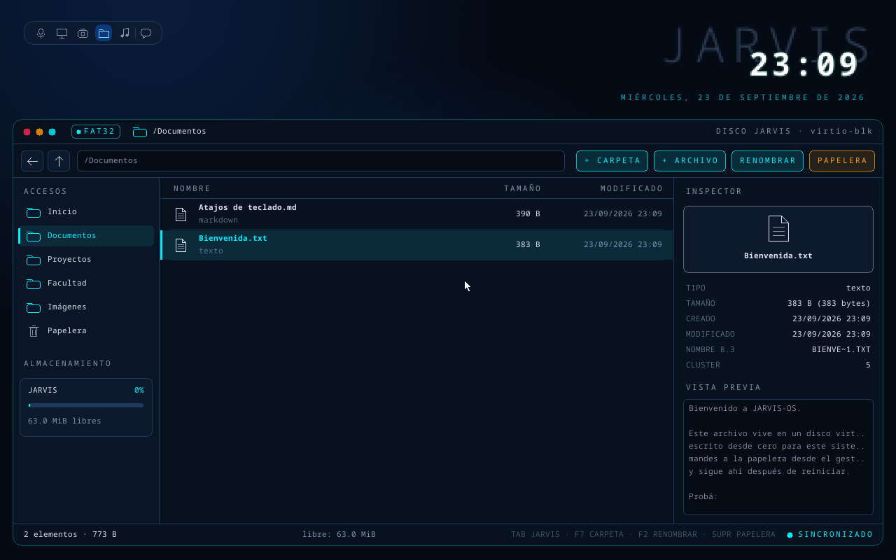

# JARVIS-OS

Un sistema operativo nuevo, con **kernel propio escrito en Rust**, cuya interfaz es un HUD con el
asistente **JARVIS** en el centro. JARVIS piensa con Claude: el "cerebro" corre en Python en el host
y el kernel le habla por un puente (puerto serie primero, red después).

| JARVIS | Archivos |
|---|---|
|  |  |

*Todo lo que se ve corre sobre el kernel propio, sin ningún sistema operativo debajo: la esfera
de partículas que late cuando JARVIS habla, y un gestor de archivos sobre un disco virtual con
un FAT32 escrito desde cero, con teclado y mouse.*

## Estado

| Parte | Qué hay | Dónde |
|---|---|---|
| Kernel | K2 ✅: disco virtio-blk, FAT32 propio, mouse PS/2 y la app Archivos. Antes: interrupciones, TSC, HUD animado. Siguiente: K3 (paginación) | [docs/kernel.md](docs/kernel.md) |
| Cerebro | Núcleo por texto: agente con Claude, 4 tools, permisos de 3 niveles, auditoría | `src/jarvis/` ([PR #1](https://github.com/IamRoman-rb/jarvis-os/pull/1)) |
| Puente kernel ↔ cerebro | Hito K4 | — |

## Probarlo

Requisitos: [rustup](https://rustup.rs), [QEMU](https://www.qemu.org) y, en Windows, el compilador
de C++ de Visual Studio. El toolchain nightly correcto se instala solo.

```bash
cd kernel
cargo xtask run      # compila y abre JARVIS-OS en QEMU (Espacio = JARVIS habla, Tab = Archivos)
```

Más comandos (tests, capturas, disco para VirtualBox): [docs/kernel.md](docs/kernel.md).

El cerebro (Python, con [uv](https://docs.astral.sh/uv/)):

```bash
uv sync && uv run pytest
```

## Estructura

```
kernel/            workspace Rust
  gfx/             dibujo: HUD, esfera, texto (no_std, testeable en el host)
  fs/              FAT32 propio (no_std, testeado contra fatfs)
  desktop/         escritorio y app Archivos (no_std, testeable en el host)
  kernel/          el kernel: arranque, interrupciones y drivers
  xtask/           imagen booteable, disco virtual, QEMU, tests de punta a punta
  rootfs/          contenido inicial del disco virtual
src/jarvis/        cerebro: agente, tools, política de permisos, auditoría
design/            design system "Obsidian Kinetic HUD" y mockups
docs/              kernel.md, ADRs, permisos, investigación inicial
CLAUDE.md          instrucciones para desarrollar con Claude Code
```

## Decisiones

- [ADR 0003](docs/adr/0003-kernel-propio-rust.md): kernel propio en Rust (reemplaza la base Debian + XFCE).
- ADR 0002: el cerebro usa el Claude Agent SDK, aislado y con una sola compuerta de permisos (llega con el [PR #1](https://github.com/IamRoman-rb/jarvis-os/pull/1)).
- [Investigación inicial](docs/investigacion.md): la capa JARVIS, la sincronización y Android siguen vigentes.
