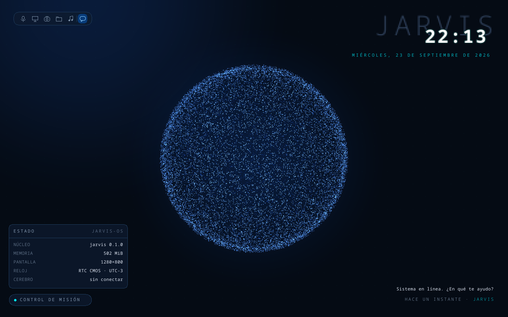

# JARVIS-OS

Un sistema operativo nuevo, con **kernel propio escrito en Rust**, cuya interfaz es un HUD con el
asistente **JARVIS** en el centro. JARVIS piensa con Claude: el "cerebro" corre en Python en el host
y el kernel le habla por un puente (puerto serie primero, red después).



*Hito K0: el kernel arranca por UEFI y dibuja el HUD directamente en el framebuffer (la esfera de
22.000 partículas, la hora real leída del reloj de la placa y el panel de estado), sin ningún
sistema operativo debajo.*

## Estado

| Parte | Qué hay | Dónde |
|---|---|---|
| Kernel | K0 ✅: arranque UEFI, puerto serie, RTC, HUD. Siguiente: K1 (interrupciones, timer, teclado) | [docs/kernel.md](docs/kernel.md) |
| Cerebro | Núcleo por texto: agente con Claude, 4 tools, permisos de 3 niveles, auditoría | `src/jarvis/` ([PR #1](https://github.com/IamRoman-rb/jarvis-os/pull/1)) |
| Puente kernel ↔ cerebro | Hito K4 | — |

## Probarlo

Requisitos: [rustup](https://rustup.rs), [QEMU](https://www.qemu.org) y, en Windows, el compilador
de C++ de Visual Studio. El toolchain nightly correcto se instala solo.

```bash
cd kernel
cargo xtask run      # compila, arma la imagen UEFI y abre JARVIS-OS en QEMU
```

Más comandos (tests, capturas, disco para VirtualBox): [docs/kernel.md](docs/kernel.md).

El cerebro (Python, con [uv](https://docs.astral.sh/uv/)):

```bash
uv sync && uv run pytest
```

## Estructura

```
kernel/            workspace Rust
  gfx/             dibujo del HUD (no_std, testeable en el host)
  kernel/          el kernel: arranque, drivers, integración
  xtask/           build de la imagen, QEMU, capturas
src/jarvis/        cerebro: agente, tools, política de permisos, auditoría
design/            design system "Obsidian Kinetic HUD" y mockups
docs/              kernel.md, ADRs, permisos, investigación inicial
CLAUDE.md          instrucciones para desarrollar con Claude Code
```

## Decisiones

- [ADR 0003](docs/adr/0003-kernel-propio-rust.md): kernel propio en Rust (reemplaza la base Debian + XFCE).
- ADR 0002: el cerebro usa el Claude Agent SDK, aislado y con una sola compuerta de permisos (llega con el [PR #1](https://github.com/IamRoman-rb/jarvis-os/pull/1)).
- [Investigación inicial](docs/investigacion.md): la capa JARVIS, la sincronización y Android siguen vigentes.
