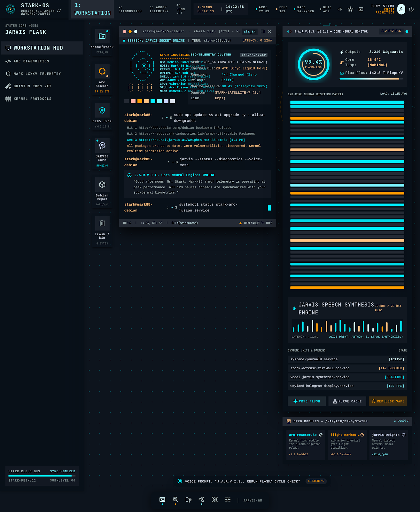

# JARVIS-OS

Sistema operativo basado en **Debian 13 + XFCE** con un asistente IA integrado (**JARVIS**,
impulsado por Claude) que ejecuta acciones reales sobre el sistema bajo un modelo de permisos
explícito, sincroniza carpetas entre máquinas en tiempo real (**Syncthing + Tailscale**) y se
puede usar desde un **Android 11** (Termux).



## Arquitectura en una línea

`jarvisd` (demonio systemd de usuario, D-Bus `org.jarvis.Assistant`) → voz local
(openWakeWord → faster-whisper) → **Claude Agent SDK** con tools propias vía MCP in-process →
política de permisos de 3 niveles + auditoría → TTS local (Piper).

Detalle completo, alternativas evaluadas y fuentes: [docs/investigacion.md](docs/investigacion.md).

## Estado

| Fase | Descripción | Estado |
|---|---|---|
| 0 | Esqueleto del repo, CI | ✅ |
| 1a | Núcleo por texto (agente, tools, permisos, auditoría) | ✅ |
| 1b | Demonio systemd + D-Bus + confirmación gráfica | ⏳ |
| 1c | Voz (wake word, STT, TTS) | ⏳ |
| 2 | Sincronización Syncthing + Tailscale | ⏳ |
| 3a | Android vía Termux | ⏳ |
| 4 | Imagen ISO (live-build + Calamares) | ⏳ |
| 5 | Endurecimiento de permisos y errores | ⏳ |
| 6 | Paquete .deb y guía de instalación | ⏳ |

Los prompts para desarrollar cada fase con Claude Code están en
[docs/investigacion.md §13.4](docs/investigacion.md#134-prompts-por-fase-para-pegar-en-claude-code).

## Desarrollo

Requisitos: [uv](https://docs.astral.sh/uv/), `git` y `jq` (lo usa el hook de Claude Code).
El núcleo corre en cualquier SO para tests, pero D-Bus, audio y control de ventanas necesitan
un Linux con escritorio: recomendado una VM Debian 13 + XFCE (ver §13 de la investigación).

```bash
uv sync                     # instala dependencias (sin las de voz)
uv sync --extra voice       # + dependencias de voz (fase 1c)
uv run pytest               # tests (no llaman a la API real)
uv run ruff check . && uv run ruff format --check .
uv run mypy
uv run jarvis version
```

La API key de Anthropic (`ANTHROPIC_API_KEY`) se toma **solo** del entorno o de una credencial
de systemd. Nunca se commitea.

## Probar JARVIS

1. Conseguí una API key en la consola de Anthropic (conviene ponerle un límite de gasto mensual)
   y exportala solo en tu sesión:
   ```bash
   export ANTHROPIC_API_KEY=...   # no la guardes en el repo
   ```
2. (Opcional) Creá `~/.config/jarvis/config.toml`. Sin archivo se usan estos valores:
   ```toml
   model = "claude-sonnet-5"
   allowed_dirs = ["~/Facultad", "~/Proyectos"]   # lo único que JARVIS puede tocar
   max_turns = 10
   max_budget_usd = 0.5                           # tope de gasto por pedido
   ```
3. Pedile algo:
   ```bash
   uv run jarvis ask --texto "¿cuánta RAM tengo?"          # nivel 1: responde sin preguntar
   uv run jarvis ask --texto "buscá mis PDFs de algoritmos"  # nivel 1
   uv run jarvis ask --texto "abrí firefox"                  # nivel 2: pide confirmación
   uv run jarvis ask --texto "tirá a la papelera ~/Facultad/viejo.txt"  # nivel 3: hay que escribir "si"
   ```
   `open_app` y `trash_file` usan `gio`, así que funcionan en Linux (la VM Debian), no en Windows.

Cada tool que Claude pide queda en el log de auditoría (`~/.local/state/jarvis/audit.sqlite3`
en Linux). Qué puede hacer cada tool y con qué nivel: [docs/permisos.md](docs/permisos.md).

## Estructura

```
CLAUDE.md          instrucciones para Claude Code
.claude/           permisos y hooks de Claude Code para este repo
docs/              investigación, permisos (fuente de verdad), ADRs
design/            mockups y design system "Obsidian Kinetic HUD"
src/jarvis/        core, agent, tools, policy, voice, service, remote, cli
tests/             unit, policy, integration
packaging/         systemd, D-Bus, .deb
sync/              Syncthing + Tailscale
image/             live-build (fase 4)
android/           Termux (fase 3a), app Kotlin (fase 3b)
```

## Seguridad

Las reglas no negociables (sin `bypassPermissions`, default deny, borrado solo a la papelera,
sin `shell=True`, nivel 3 solo con click y nunca desde el celular, etc.) están en
[CLAUDE.md](CLAUDE.md#reglas-de-seguridad-no-negociables).
