# Kernel de JARVIS-OS

Kernel propio en Rust para x86_64 con arranque UEFI. Decisión y motivos: [ADR 0003](adr/0003-kernel-propio-rust.md).
Red y navegador: [ADR 0004](adr/0004-red-y-navegador-propio.md). Terminal, paquetes y programas de
otros sistemas: [ADR 0005](adr/0005-terminal-paquetes-y-programas.md). Motor web, firewall, snap,
winget e idiomas: [ADR 0006](adr/0006-motor-web-firewall-tiendas-e-idiomas.md). Conexiones largas,
Brave remoto, sincronización e ISO: [ADR 0007](adr/0007-brave-remoto-y-sincronizacion.md).

**Brave en JARVIS-OS**: YouTube con JavaScript, en una ventana maximizada con la barra de arriba
(íconos, ventanas abiertas, CPU, memoria, disco, red, IP y hora):

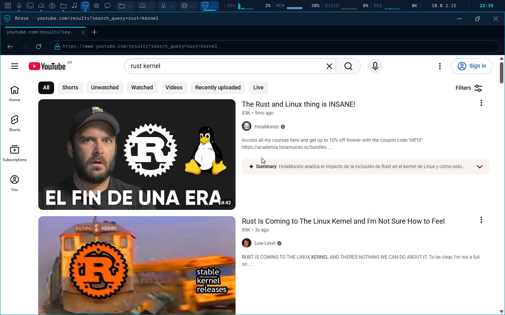

| Wikipedia en el navegador | YouTube (sin JavaScript) |
|---|---|
| 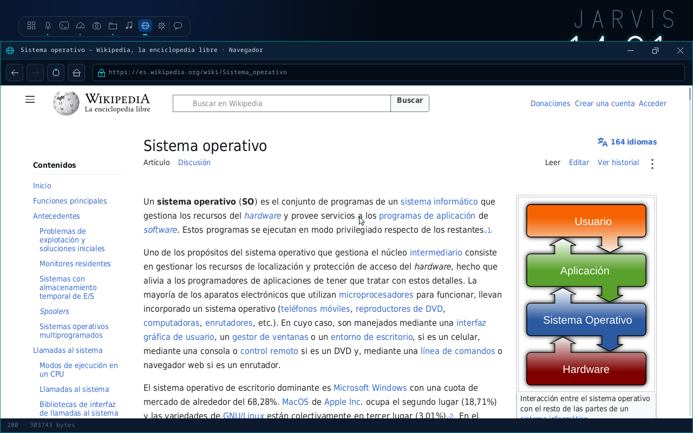 | 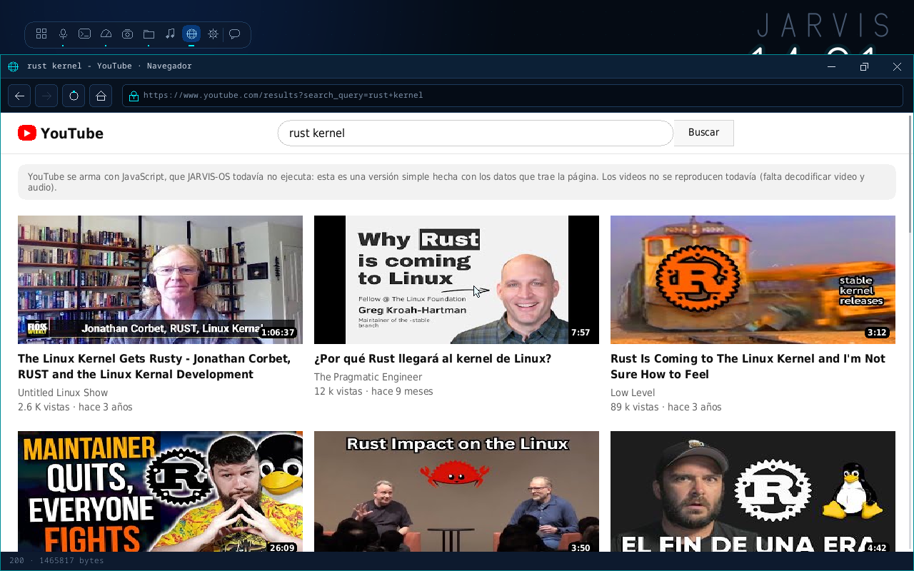 |
| **snap y ufw en la terminal** | **Firewall en la Configuración** |
| 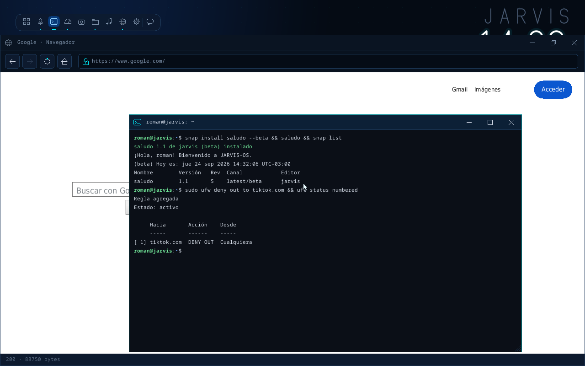 | 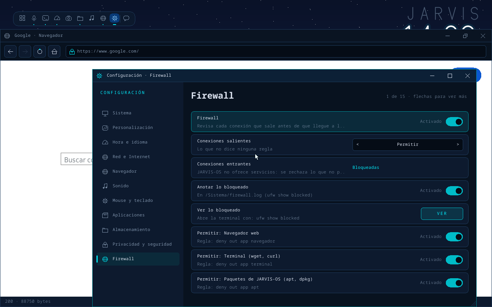 |
| **Monitor 1 (extender)** | **Monitor 2, con el Monitor del sistema** |
| 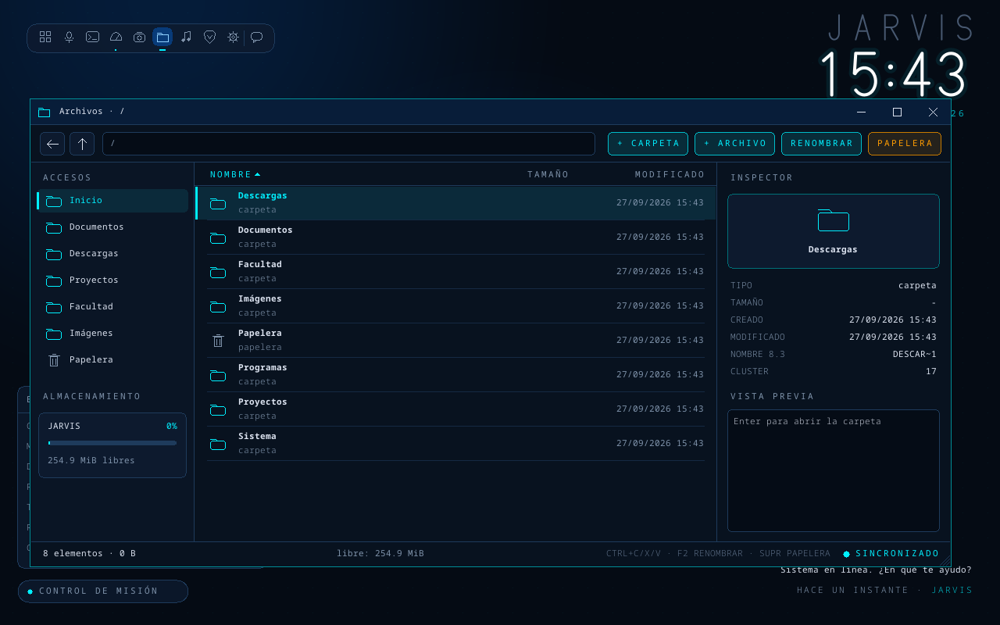 | 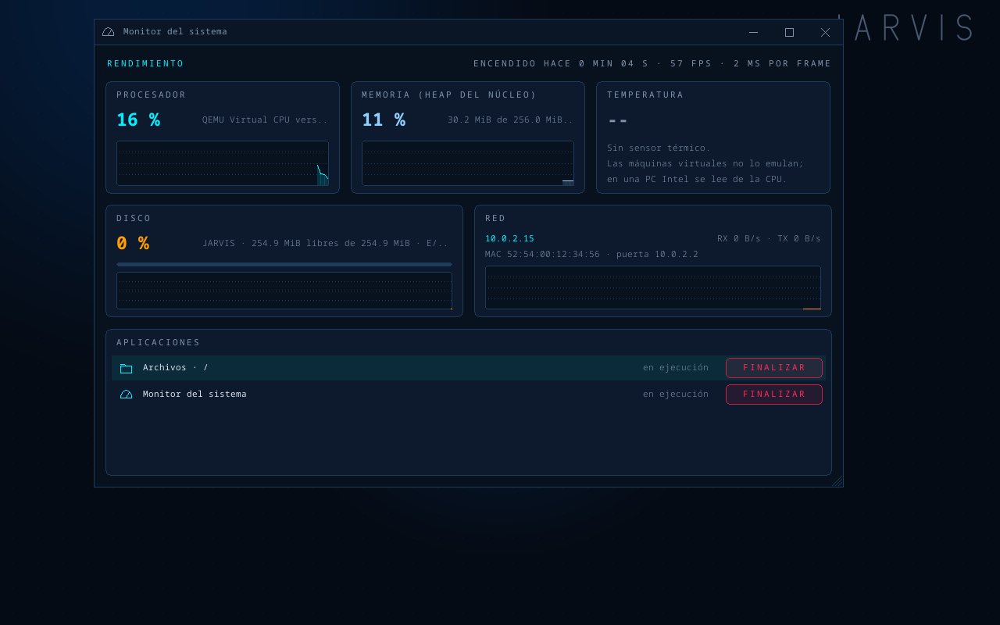 |
| **Tema claro** | **Monitor con temperatura** |
| 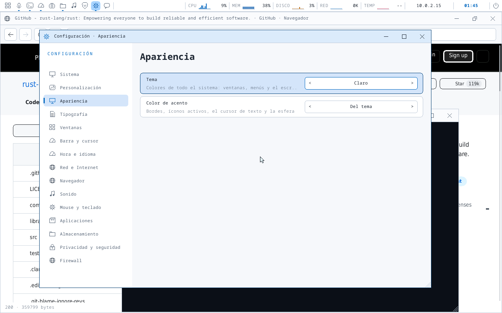 | 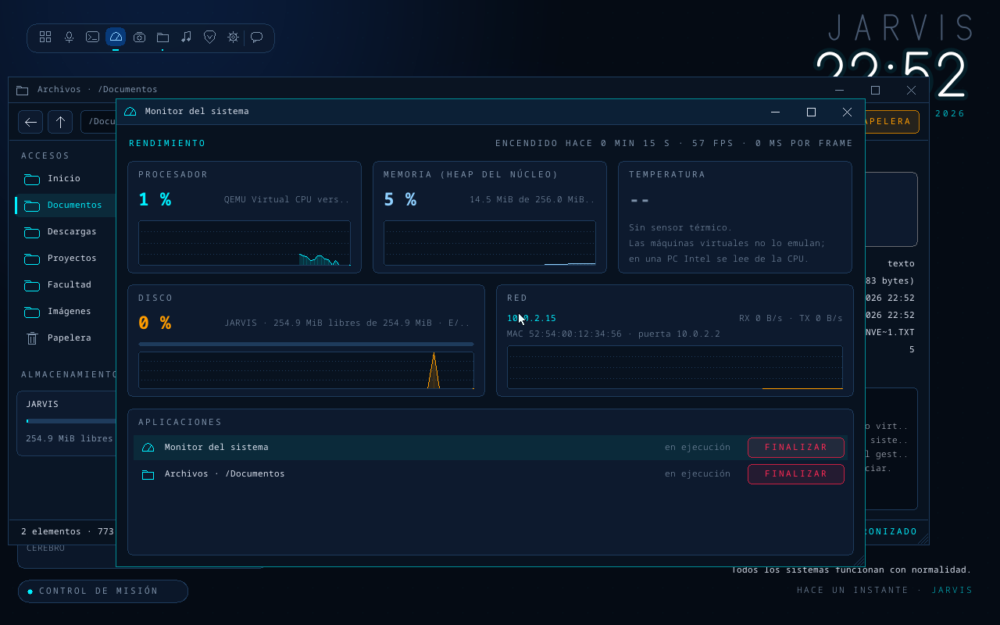 |
| **Cerrar sesión** | |
| 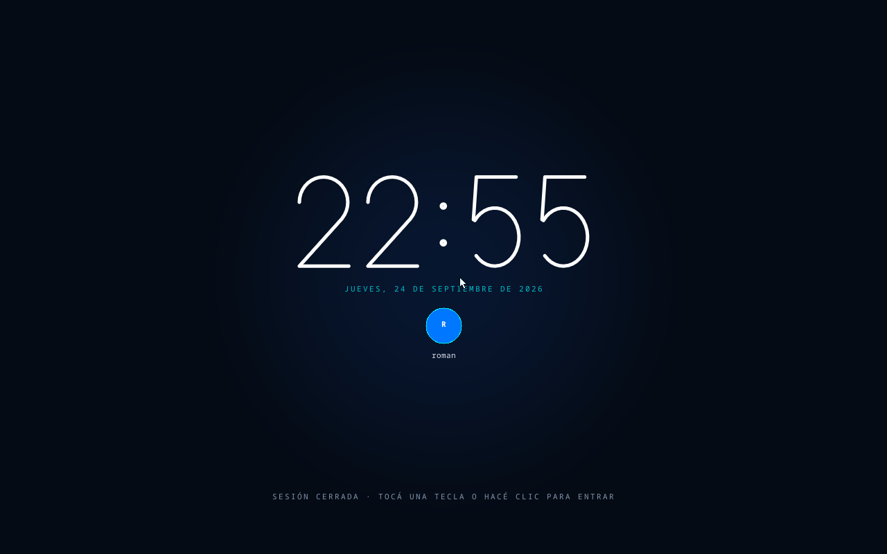 | |
| **Escritorio** | **Terminal y `apt`** |
| 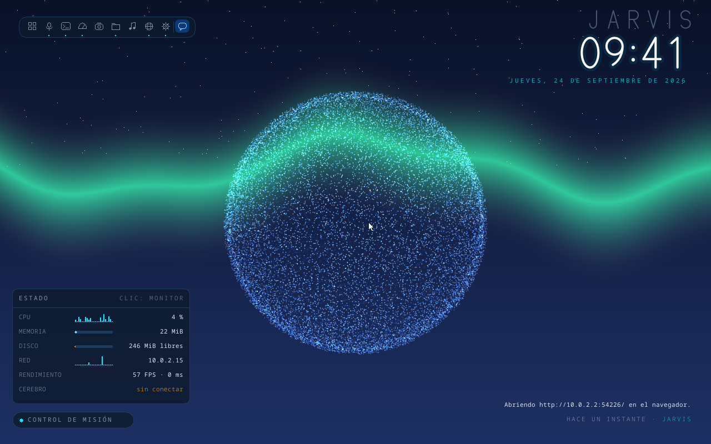 | 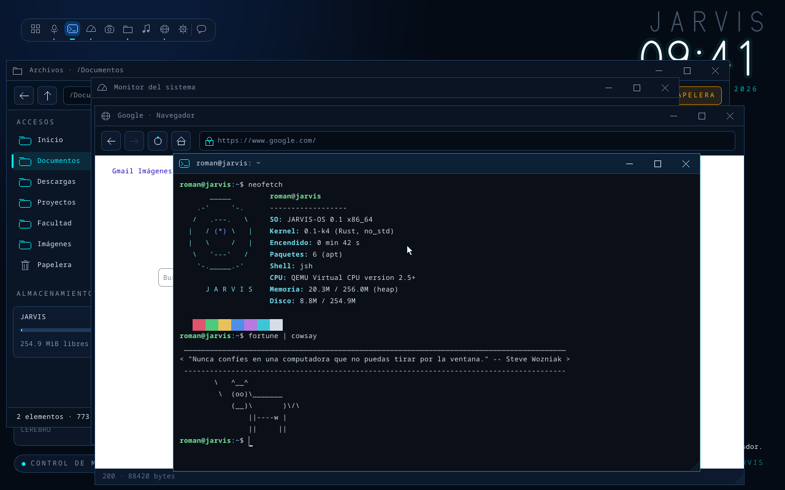 |

- **Brave**: el navegador de verdad (JavaScript, YouTube, cualquier sitio). Corre en el
  anfitrión sin ventana y JARVIS-OS lo muestra en una ventana propia, con pestañas, barra de
  dirección, atrás/adelante, mouse, rueda y teclado. Se instala con `cargo xtask brave
  --instalar`. El navegador propio de K3–K5 queda como "Navegador simple".
- **Sincronización entre máquinas**: la carpeta `/Sincronizado` se copia sola entre dos (o más)
  JARVIS, aunque estén en redes distintas. En Configuración → Sincronización se genera un código
  en una y se escribe en la otra; las dos se conectan a un **relé** (`cargo xtask relay`) que solo
  ve bytes cifrados. Si las dos cambian el mismo archivo, gana el cambio más nuevo y el otro queda
  como `nombre (conflicto de PC2).ext`; un borrado remoto va a la Papelera.
- **ISO**: `cargo xtask iso` arma `target/jarvis-os.iso`, que arranca como CD (UEFI). Sin disco,
  arranca en **modo en vivo**: un FAT32 en RAM de 48 MiB (lo que se guarda se pierde al apagar).
- **Varios monitores**: con la placa virtio-gpu (QEMU la trae con una salida por monitor de la
  PC), extender, duplicar o usar uno solo (Win+P o Configuración → Pantallas); el segundo a la
  derecha o abajo, y cuál es el principal. Win+Shift+←/→ lleva una ventana al otro monitor;
  maximizar, acoplar y las distribuciones usan el monitor de la ventana.
- **Selección como en Windows**: en Archivos, varios a la vez (Shift+flechas, Ctrl+clic,
  Shift+clic, Ctrl+E) para mover a la Papelera, copiar o cortar; en el Editor, Shift+flechas,
  arrastrar con el mouse, doble clic en una palabra y Ctrl+E, con un portapapeles del sistema.
- **Distribuciones de ventanas**: Win+Z con seis plantillas, cuartos con Win+flechas, mosaico,
  cascada, y acoplar arrastrando contra un borde o una esquina.
- **Personalización en capas** (como Windows o KDE), en la Configuración:
  - **Apariencia**: tema HUD oscuro, claro o de alto contraste, y ocho colores de acento.
  - **Tipografía**: texto grande, títulos en negrita, y la letra de la terminal y del editor.
  - **Ventanas**: animación (ninguna, desvanecer, zoom, deslizar) y su velocidad, botones del
    título a la izquierda o a la derecha, qué hace el doble clic, acoplar al arrastrar contra un
    borde, arrastrar solo el contorno, y que el foco siga al mouse.
  - **Barra y cursor**: barra de arriba sí/no, qué gráficos muestra, segundos en el reloj y
    cursor grande.
- **Energía**: apagar, reiniciar, **suspender** (pantalla negra, nada se dibuja; una tecla o el
  mouse despiertan, con PIN si hay) y **cerrar sesión** (cierra las apps; si el Editor tiene
  cambios sin guardar, no sigue). Desde el menú Inicio, Win+X, Alt+F4 en el escritorio o el botón
  de la punta derecha de la barra de arriba.
- **Temperatura** de la CPU en el Monitor, la barra de arriba y el panel de estado, leída del
  sensor térmico de Intel. En QEMU dice "sin sensor": las máquinas virtuales no lo emulan.
- **JARVIS**: la esfera gira en tiempo real y late cuando JARVIS habla. El reloj usa una fuente
  vectorial propia (nítida a cualquier tamaño), en 24 o 12 horas.
- **Ventanas como en Windows**: barra de título con minimizar, maximizar y cerrar; arrastrar para
  mover, esquina para cambiar el tamaño, doble clic para maximizar. Alt+Tab, Win+D, Win+flechas,
  escritorios virtuales, enlaces rápidos (Win+X), configuración rápida (Win+A), notificaciones con
  calendario (Win+N), menú de la ventana (Alt+Espacio) y más: ver la tabla de abajo o F1.
- **Barra de arriba**: al maximizar una ventana ocupa toda la pantalla, y arriba aparece una barra
  con los íconos, las ventanas abiertas (clic para traerla o minimizarla), gráficos en vivo de
  CPU, memoria, disco y red (clic: Monitor), la IP y la hora (clic: notificaciones).
- **Transiciones**: las ventanas aparecen, se cierran, se minimizan, vuelven, se maximizan y se
  acoplan con una animación corta (se apagan con "Animaciones" en la Configuración).
- **Terminal** (Ctrl+Alt+T): shell `jsh` parecida a bash, con tuberías, redirecciones, variables,
  comodines, historial, Tab y colores; ~80 comandos de Linux sobre el FAT32 propio y un `/proc`.
- **`apt`**: instala, actualiza y desinstala programas de JARVIS-OS desde el repositorio del
  proyecto (`kernel/paquetes/`). `neofetch`, `cowsay`, `fortune`, fondos de pantalla…
- **Programas de Windows y Linux**: se descargan (navegador, `wget`, `winget`, `snap download`) y
  se inspeccionan (`file`, `strings`, `xxd`); todavía no se pueden ejecutar (hace falta espacio de
  usuario: K11).
- **Configuración** (Win+I): fondo de pantalla, apariencia, tipografía, ventanas, idioma, zona horaria, reloj, red, navegador,
  sonido, mouse, teclado, programas, almacenamiento, PIN de bloqueo y firewall. Se guarda en
  `/Sistema/config.ini`.
- **Navegador con motor de maquetación propio**: cajas con márgenes y bordes, flotantes, flex,
  grid, tablas, posiciones, `@media`, `calc()`, variables; fuente proporcional (DejaVu) en
  cualquier tamaño; imágenes, SVG, fondos e íconos con transparencia (el puente los convierte a
  BMP). Formularios (GET), modo lectura (F9) y descargas a /Descargas. Sin JavaScript: YouTube se
  arma con los datos que trae la página; otras páginas así avisan que pueden verse incompletas.
- **Firewall**: reglas por sitio, puerto y app (`ufw` en la terminal o Configuración →
  Firewall). Lo bloqueado queda en `/Sistema/firewall.log`.
- **`snap`** (tienda propia con canales y revisiones; búsqueda y descarga en Snapcraft) y
  **`winget`** (instaladores de Windows del repositorio oficial de Microsoft, a /Descargas).
- **Idiomas**: castellano, inglés o portugués (Configuración → Hora e idioma).
- **Teclado latinoamericano** (ñ, tildes con tecla muerta, AltGr+Q = @) o de EE. UU.
- **Panel de estado** (abajo a la izquierda) con gráficos en vivo de CPU, memoria, disco y red.
- **Apps**: Brave, Archivos, Terminal, Configuración, Monitor, Consola JARVIS, Editor, Música,
  Visor y Navegador simple.
- **Red propia**: driver virtio-net, TCP/IP (smoltcp), DHCP y DNS. Las páginas `https://` pasan por
  un puente en el anfitrión (el kernel todavía no tiene TLS).

## Cómo correrlo

Requisitos: [rustup](https://rustup.rs) y [QEMU](https://www.qemu.org). En Windows también hace
falta el compilador de C++ de Visual Studio (Build Tools). El toolchain nightly correcto se instala
solo la primera vez, porque está fijado en `kernel/rust-toolchain.toml`.

```bash
cd kernel
cargo xtask run          # QEMU con ventana, disco persistente, red, sonido y el puente
cargo xtask test         # sin ventana, de punta a punta (lo usa la CI)
cargo xtask screenshot   # capturas del escritorio, las apps y los menús (en target/)
cargo xtask disk --reset # vuelve el disco a su contenido inicial (kernel/rootfs/)
cargo xtask vdi          # target/jarvis-os.vdi para bootear en VirtualBox (VM con EFI)
cargo xtask relay        # el relé de la sincronización (--publico para abrirlo a la red)
cargo xtask run2         # dos JARVIS (PC1 y PC2, cada uno con su disco) unidos por el relé
cargo xtask sincronizar  # prueba: dos QEMU se emparejan, se mandan archivos, renombre → Papelera
cargo xtask iso          # target/jarvis-os.iso (--probar: la arranca sin ventana; --abrir: con ventana)
cargo xtask pantallas    # dos monitores: extender, mover una ventana, Win+P, duplicar (capturas)
cargo xtask brave --instalar           # instala Brave en el anfitrión (winget)
cargo xtask brave --probar https://…   # prueba el puente de Brave sin QEMU (target/brave-prueba.png)
cargo test               # tests en el host: FAT32, red, escritorio, terminal y gráficos
```

- **El disco** es `kernel/target/disco.img` (FAT32, etiqueta `JARVIS`). Se crea la primera vez con
  el contenido de `kernel/rootfs/` y después **no se toca**: lo que hagas queda guardado entre
  reinicios. Los discos nuevos son de 256 MiB (los creados antes de K4, de 64 MiB, siguen
  funcionando; `disk --reset` crea uno nuevo pero **borra** lo que tenía). Se puede abrir desde
  Windows con 7-Zip.
- **Mouse y teclado**: hacé clic en la ventana de QEMU para que los "capture" (Ctrl+Alt+G los
  libera). Mientras están capturados, la tecla Windows y Alt+Tab van a JARVIS-OS y no a Windows.
  Si Windows igual se queda con alguna combinación (Ctrl+Alt+Supr siempre es de Windows), usá el
  ícono de inicio, el menú de inicio o "Control de misión".
- **Teclado**: por defecto, latinoamericano. Si tu teclado es de EE. UU. (o los símbolos no
  coinciden), cambialo en Configuración → Mouse y teclado.
- **Sonido**: el parlante de la PC suena por DirectSound en Windows. En Linux, definí
  `QEMU_AUDIO=pa` (o `alsa`) antes de `cargo xtask run`.
- **Red**: QEMU da una red privada con DHCP (JARVIS-OS queda en 10.0.2.15) y sale a internet por
  la computadora anfitriona. El puente (HTTPS, imágenes y paquetes) escucha solo en
  127.0.0.1:8118 mientras dura `run`: sin `cargo xtask run`, no hay `https://`, `apt`, `snap` ni
  `winget`.
- **Brave**: mientras dura `cargo xtask run` también corre el puente de Brave (127.0.0.1:8119,
  que QEMU ve como 10.0.2.2:8119). Brave usa su propio perfil (`kernel/target/brave-perfil`:
  cookies y sesiones), separado del Brave que uses en Windows. Para usarlo desde otra máquina:
  `cargo xtask brave --red --token <secreto>` y, en esa máquina, Configuración → Navegador.
- **Monitores**: `xtask` le pregunta a Windows cuántos monitores hay y le da a QEMU una
  `virtio-vga` con una salida por monitor (QEMU abre una ventana o pestaña por salida).
  `JARVIS_MONITORES=2 cargo xtask run` suma uno virtual para probar con una sola pantalla.
- Los logs del kernel (puerto serie) salen en la terminal donde corriste `cargo xtask run`.
- En Windows, `xtask` usa la aceleración por hardware (WHPX) si está disponible.
- Para compilar mientras tenés QEMU abierto (la imagen queda bloqueada), usá otra carpeta de
  salida: `CARGO_TARGET_DIR=target/otra cargo xtask test`.

### Atajos de teclado (como en Windows)

| Atajo | Qué hace |
|---|---|
| Win (sola) · Win+S · Ctrl+Esc | menú de inicio: escribí para buscar apps o una dirección web |
| Alt+Tab / Alt+Shift+Tab | cambiar de ventana (con Alt apretado se ve el selector) |
| Alt+Esc | pasar a la ventana siguiente, sin selector |
| Win+Tab | vista de tareas ("Control de misión") |
| Win+D · Win+, | mostrar el escritorio (JARVIS); otra vez, volver |
| Win+M · Win+Shift+M | minimizar todo · volver a mostrar lo minimizado |
| Win+Inicio | minimizar todas menos la activa |
| Win+↑ / Win+↓ | maximizar / restaurar o minimizar; con la ventana en una mitad, el cuarto de arriba / abajo |
| Win+← / Win+→ · Win+Shift+↑ | acoplar a la mitad izquierda / derecha · estirar a lo alto |
| Win+Z | distribuciones: mitades, tercios, 2/3 + 1/3, cuartos, grande + dos, columna central (las demás ventanas completan) |
| Win+Shift+T · Win+Shift+C | mosaico con todas las ventanas · cascada |
| Win+P · Win+Shift+← / → | monitores: solo 1, duplicar, extender, solo 2 · llevar la ventana al otro monitor |
| arrastrar contra un borde / esquina | mitad / cuarto (arriba: maximizar) |
| Win+Ctrl+D · Win+Ctrl+← / → · Win+Ctrl+F4 | escritorio virtual nuevo · cambiar · cerrarlo |
| Alt+Espacio · clic derecho en la barra de título | menú de la ventana (restaurar, minimizar, maximizar, acoplar, botones a la izquierda o derecha, cerrar) |
| Alt+F4 · Ctrl+W | cerrar la ventana (Ctrl+W si la app no lo usa); sin ventanas, Alt+F4 ofrece apagar |
| F11 | maximizar la ventana |
| Win+X | enlaces rápidos (apps, monitor, configuración, terminal, apagar…) |
| Win+A | configuración rápida (sonidos, animaciones, páginas claras, reloj…) |
| Win+N · Win+Alt+D | notificaciones y calendario |
| Win+I | Configuración |
| Win+E | Archivos |
| Win+R | Consola de JARVIS ("Ejecutar") |
| Ctrl+Alt+T · Win+Enter | Terminal (como en Ubuntu) |
| Ctrl+Shift+Esc · Ctrl+Alt+Supr | Monitor del sistema |
| Win+1 … Win+9, Win+0 | el ícono número N de la barra |
| Win+L | bloquear (con PIN, si hay uno en la Configuración) |
| Impr Pant · Win+Shift+S | captura de pantalla a /Imágenes (BMP) |
| Alt+Impr Pant | captura solo de la ventana activa |
| Win+Ctrl+Shift+B | redibujar toda la pantalla |
| F1 | ayuda con todos los atajos |

En el escritorio (sin ventana con foco): Espacio o clic en la esfera hace hablar a JARVIS, Tab
abre Archivos.

| Archivos | |
|---|---|
| Enter / doble clic | abrir: carpeta, texto → editor, BMP → visor, HTML → navegador, `.sh` → se ejecuta, `.exe` → la terminal dice qué es |
| Retroceso / Alt+↑ | subir una carpeta · Alt+← atrás |
| F7 o Ctrl+Shift+N / F6 | nueva carpeta / nuevo archivo de texto |
| F2 | renombrar |
| Ctrl+E · Ctrl+A | seleccionar todo |
| Shift+↑↓ (y Inicio/Fin/RePág/AvPág) · Ctrl+clic · Shift+clic | elegir varios |
| Ctrl+C / Ctrl+X / Ctrl+V | copiar / cortar / pegar (también varios y carpetas enteras) |
| Supr | a la Papelera (adentro de la Papelera: borrar definitivo, con confirmación) |
| RESTAURAR (en la Papelera) | vuelve a la carpeta de donde vino |
| Clic en NOMBRE / TAMAÑO / MODIFICADO | ordenar por esa columna |
| Letras | ir al primer elemento que empieza así |
| F5 | recargar |

| Navegador | |
|---|---|
| Ctrl+L / Alt+D / F6 / clic en la barra | escribir una dirección o una búsqueda; Enter va |
| Tab / Shift+Tab, Enter | recorrer enlaces y campos de formularios; abrir o enviar (o clic) |
| Alt+← / Retroceso · Alt+→ | atrás · adelante |
| F5 / Ctrl+R · Ctrl+H | recargar · inicio |
| F9 | modo lectura (solo el contenido) |
| Clic en un enlace `#sección` | baja hasta esa parte de la página |
| Flechas, RePág, AvPág, Espacio, rueda | moverse por la página |

| Terminal | |
|---|---|
| Tab | completar comandos y rutas (dos opciones o más: las muestra) |
| ↑ / ↓ | historial |
| Ctrl+C | cancelar la línea o el comando en curso (una descarga, `sleep`) |
| Ctrl+L · Ctrl+A / Ctrl+E · Ctrl+U / Ctrl+K · Ctrl+W | limpiar · inicio / fin · borrar hasta el inicio / el fin · borrar la palabra |
| RePág / AvPág, rueda | moverse por lo que ya salió |
| Ctrl+D (línea vacía), `exit` | cerrar la terminal |

| Editor | Consola JARVIS | Música |
|---|---|---|
| Ctrl+S guarda (si es nuevo, pide la ruta) | `ayuda` lista las órdenes | ↑ ↓ elegir, Enter reproducir |
| Ctrl+Inicio / Ctrl+Fin | `abrir`, `ir`, `buscar`, `ls`, `cat`, `editar` | Esc detener |
| Cerrar con cambios avisa una vez | `hora`, `estado`, `red`, `captura`, `apagar` | |

### La terminal

```
roman@jarvis:~$ ls -l Documentos | grep txt > lista.txt && cat lista.txt
roman@jarvis:~$ cd Proyectos; cp -r ../Documentos respaldo; tree
roman@jarvis:~$ wget https://ejemplo.com/archivo.zip       # descarga a la carpeta actual
roman@jarvis:~$ find / -name "*.bmp" | wc -l
roman@jarvis:~$ apt update && apt install neofetch && neofetch
```

- **Comandos**: `ls cd pwd cat head tail wc grep sed sort uniq cut tr rev tee seq expr echo
  printf find tree du df free stat file xxd strings touch mkdir rmdir rm cp mv ps kill top uname
  whoami hostname id date cal uptime ip ping curl wget apt dpkg snap winget ufw history alias
  export env which test sleep sh open nano jarvis screenshot reboot shutdown exit` y más (`help`,
  `man <comando>`).
- **Shell**: `|`, `>`, `>>`, `<`, `2>`, `2>&1`, `&&`, `||`, `;`, `'…'`, `"…$VAR…"`, `$(…)`, `$?`,
  `*.txt`, `~`, alias (`ll`, `la`, `dir`, `cls`, `ipconfig`…), `VAR=valor`.
- **`/proc`**: `cpuinfo`, `meminfo`, `uptime`, `version`, `loadavg`.
- **`rm` no borra para siempre**: manda a la Papelera, como la app Archivos.
- **Programas propios**: un archivo en `/Programas/bin` con comandos (uno por línea) es un
  programa: `nano /Programas/bin/saludo`, escribí `echo Hola, $1` y después `saludo Roman`.

### Paquetes: `apt`

| Orden | Qué hace |
|---|---|
| `apt update` | baja la lista de paquetes del repositorio |
| `apt list` (`--installed`, `--upgradable`) · `apt search x` · `apt show x` | ver qué hay |
| `apt install x y` | instala (con dependencias) |
| `apt remove x` | desinstala: los archivos van a la Papelera |
| `apt upgrade` | actualiza lo instalado |

El repositorio es la carpeta `kernel/paquetes/` (lo sirve el puente en `http://paquetes.jarvis/`):
`indice.txt` y un `manifiesto.txt` por paquete. Para agregar un paquete: una carpeta con sus
archivos y su manifiesto (`origen -> /destino`, `[bmp]` si es una imagen a convertir), y un
renglón en el índice. Paquetes de ejemplo: `neofetch`, `cowsay`, `fortune`, `sl`, `calc`, `hola`,
`fondos`, `manual` y `esenciales` (instala varios de una vez).

### `snap`

```
roman@jarvis:~$ snap find                     # la tienda de JARVIS-OS
roman@jarvis:~$ snap find vlc                 # también busca en la tienda real (Snapcraft)
roman@jarvis:~$ snap install saludo && saludo Ana
roman@jarvis:~$ snap refresh saludo --beta    # al canal beta (revisión 5)
roman@jarvis:~$ snap revert saludo            # vuelve a la revisión 3
roman@jarvis:~$ snap list · snap info saludo · snap remove saludo
roman@jarvis:~$ snap download hello-world     # un .snap de Linux a /Descargas (no se ejecuta)
```

Cada revisión queda en `/snap/<nombre>/<revisión>/`; `/snap/bin` está en el `PATH`. La tienda es
`kernel/paquetes/snaps/`: `indice.txt` (`nombre|versión|revisión|canal|editor|resumen|tamaño|comando`)
y una carpeta por revisión con su `manifiesto.txt`. Snaps de ejemplo: `saludo` (con canal beta),
`notas`, `dado` y `reloj`.

### `winget` (programas de Windows)

```
roman@jarvis:~$ winget search zip
roman@jarvis:~$ winget show 7zip.7zip          # del repositorio oficial de Microsoft (GitHub)
roman@jarvis:~$ winget install 7zip.7zip       # baja el instalador de 64 bits a /Descargas
roman@jarvis:~$ file /Descargas/7z2408-x64.exe
```

`winget search` busca en `kernel/paquetes/winget.txt`; con el Id exacto, `show` e `install` van
al repositorio real. Los instaladores no se ejecutan (ADR 0005); hasta 32 MB por descarga.

### Firewall: `ufw`

```
roman@jarvis:~$ sudo ufw deny out to tiktok.com          # también sus subdominios
roman@jarvis:~$ sudo ufw deny out port 80 app navegador  # el navegador, sin http://
roman@jarvis:~$ sudo ufw default deny outgoing && sudo ufw allow out to wikipedia.org
roman@jarvis:~$ ufw status numbered · ufw delete 1 · ufw show blocked · ufw app list
```

Las reglas se evalúan en orden (gana la primera). Las apps que se pueden nombrar: `navegador`,
`terminal`, `apt`, `snap`, `winget`, `configuracion`, `jarvis` y `sistema`. Lo mismo se maneja
desde Configuración → Firewall. Lo que entra ya está cerrado: JARVIS-OS no escucha en ningún
puerto.

## Arquitectura

```
firmware UEFI (OVMF en QEMU)
  └─ bootloader (crate bootloader 0.11): modo 64 bits, tablas de páginas, framebuffer,
     mapeo de toda la memoria física
       └─ kernel_main (kernel/kernel/src/main.rs) — solo hardware
            ├─ serial.rs      COM1: logs al host
            ├─ gdt.rs         GDT + TSS (stack de emergencia para el doble fallo)
            ├─ interrupts.rs  IDT: excepciones, timer (IRQ0), teclado (IRQ1), mouse (IRQ12)
            ├─ pit.rs         PIT: despierta al bucle (250 Hz) y calibra el TSC
            ├─ time.rs        reloj en ms con el TSC
            ├─ queue.rs       cola de bytes sin locks (interrupción → bucle)
            ├─ keyboard.rs    teclado PS/2 → teclas y modificadores (Alt, Ctrl, Win, AltGr),
            │                 distribución EE. UU. o latinoamericana (desktop/keymap.rs)
            ├─ mouse.rs       mouse PS/2 con rueda (puerto auxiliar del 8042)
            ├─ allocator.rs   heap de 256 MiB (alloc: Vec, String)
            ├─ pci.rs         enumeración del bus PCI
            ├─ virtio_blk.rs  driver de disco virtio-blk (DMA, virtqueue, polling)
            ├─ virtio_net.rs  driver de placa de red virtio-net (dos virtqueues, polling)
            ├─ speaker.rs     parlante de la PC (canal 2 del PIT)
            ├─ power.rs       apagar (ACPI de QEMU) y reiniciar (8042)
            ├─ cpu.rs         nombre de la CPU (cpuid)
            ├─ rtc.rs         reloj CMOS → fecha y hora
            └─ bucle          hlt → red → eventos → render → present → pedidos → estadísticas
                 ├─ jarvis-net      TCP/IP (smoltcp), DHCP, DNS, descargas HTTP
                 └─ jarvis-desktop  ventanas, atajos, apps, barra, panel, menús, configuración,
                    │               firewall, idiomas, terminal (jsh, apt, snap, winget, ufw),
                    │               web (DOM, CSS, estilos, maquetación en cajas, HTTP)
                      ├─ jarvis-fs   FAT32 sobre el disco (con caché de sectores)
                      └─ jarvis-gfx  dibujo: HUD, esfera, texto, fuente vectorial, fuente de las
                                     páginas (DejaVu + fontdue), figuras
```

| Crate | Qué es | Cómo se prueba |
|---|---|---|
| `gfx` (`jarvis-gfx`) | Dibujo: canvas con recorte (anidado) y `blit`, paleta, texto, **fuente vectorial**, **fuente proporcional de las páginas** (DejaVu, cualquier tamaño), figuras, íconos, trigonometría en punto fijo, esfera, asistente, HUD. | `cargo test`: 39 tests |
| `fs` (`jarvis-fs`) | FAT32 propio: montaje, FAT (dos copias), nombres largos, lectura, escritura, carpetas, renombrar, mover, **copiar**, borrar, **caché de sectores**. Sobre un trait `BlockDevice`. | 22 tests, 14 de ellos **cruzados contra `fatfs`**: cada uno lee lo que escribe el otro, y el espacio libre se cuenta sobre la FAT cruda |
| `desktop` (`jarvis-desktop`) | Escritorio: gestor de ventanas (con escritorios virtuales), atajos, barra, panel de estado, menús y paneles, configuración, firewall, idiomas, composición; apps (Archivos, Terminal, Configuración, Monitor, Consola, Editor, Música, Visor, Navegador); shell `jsh`, `apt`, `snap`, `winget`, `ufw`, formatos PE/ELF/squashfs; web: URL, HTTP, DOM, selectores y cascada, maquetación en cajas (flujo, flotantes, flex, grid, tablas), JSON, adaptador de YouTube; teclado latinoamericano. | 116 tests: el escritorio manejado con teclas y clics sobre un disco en memoria, verificado con `fatfs`; la terminal, `apt`, `snap` y `winget` contra el repositorio real y respuestas grabadas; el firewall; la maquetación sobre HTML de prueba; incluye "render incremental == redibujar todo". Más `vista_previa` (a mano): arma una página real, con imágenes, y la guarda en BMP |
| `net` (`jarvis-net`) | Red: smoltcp, DHCP, DNS (con respaldo), descargas HTTP con redirecciones, HTTPS por el puente, conexiones TCP largas. | 5 tests de punta a punta en memoria (placa "loopback" + servidores de juguete) |
| `kernel` (`jarvis-kernel`) | El binario sin sistema operativo debajo. Solo hardware → eventos, bloques y píxeles. | `cargo xtask test` en QEMU |
| `xtask` | Imagen booteable, disco FAT32, QEMU (serie + monitor + red + audio), puente (HTTPS, repositorio de paquetes, conversión de imágenes y SVG a BMP con transparencia), puente de Brave (DevTools → mosaicos LZ4), test de punta a punta, capturas. | 2 tests (el puente no sale de su carpeta; PNG y SVG → BMP) y `cargo xtask test` |

## Lo que se aprendió (y por qué el código es así)

### K6: Brave, sesión, personalización y sincronización
- **Un navegador remoto es un VNC con más información**: en vez de mandar la pantalla entera, el
  puente le pide a Brave cada cuadro por DevTools (`Page.startScreencast`), lo compara con el
  anterior en mosaicos de 64×64 y manda solo los que cambiaron, comprimidos con LZ4. Una página
  entera son ~1 MB la primera vez, y después unos pocos KB por cambio. Además de la imagen viajan
  las pestañas, el título y si se puede ir atrás: por eso la barra la dibuja JARVIS.
- **Control de flujo de punta a punta**: Brave no manda otro cuadro hasta que se le confirma el
  anterior, y el puente no se lo confirma hasta que el kernel confirmó el suyo. Si el kernel está
  ocupado, los cuadros intermedios se descartan en vez de acumularse (lo que importa es el último).
- **El mismo protocolo en los dos lados**: `desktop/src/remote.rs` es `no_std` y lo usan el kernel y
  el puente (que corre en Windows). Un cambio de formato no puede quedar a medias.
- **Conexiones largas**: hasta K5 la red solo hacía "pedí esto, dame la respuesta". Una conexión
  que dura necesita una cola de salida con tope (si el otro lado no lee, es un error y no se come
  la memoria) y un cierre en dos pasos: en smoltcp, sacar el socket enseguida después de
  `close()` hacía que el FIN no saliera nunca.
- **Sincronización = estado por archivo, no un registro de eventos**: cada archivo guarda su hash,
  un **reloj de Lamport** (un contador que salta al máximo visto + 1: ordena cambios de máquinas
  sin relojes de pared confiables) y su **origen**, la versión en la que las dos coincidieron. Un
  cambio que llega con un origen distinto de la versión local, si la local también cambió, es un
  conflicto; las dos máquinas deciden lo mismo sin hablar (gana el reloj más alto; empate, el id
  de máquina). El motor (`kernel/sync/`) no sabe de discos ni de red: se prueba entero en el host
  con dos máquinas simuladas.
- **Cifrado autenticado en vez de TLS**: las dos puntas comparten el código de emparejado, así que
  alcanza con HKDF (código → id de grupo + clave) y ChaCha20-Poly1305 con un nonce de id de
  máquina + contador; un contador repetido se descarta. El kernel compila sin SSE/AVX: las crates
  de cifrado van con sus versiones por software (`--cfg chacha20_force_soft` en `.cargo/config.toml`;
  la de AVX2 hacía fallar a LLVM).
- **El relé no guarda nada**: reenvía a quien esté conectado. Un manifiesto mandado antes de que la
  otra máquina llegue se pierde, así que al recibir el de una máquina nueva se contesta con el
  propio (lo encontró la prueba con dos QEMU, no los tests en memoria).
- **El Torito**: una ISO 9660 mínima (descriptores, tabla de rutas, raíz) con un catálogo que
  apunta a una imagen FAT "sin emulación" para EFI: la partición EFI que ya genera el bootloader,
  sacada de la tabla GPT. El firmware la monta y ejecuta `EFI/BOOT/BOOTX64.EFI`.
- **virtio moderno**: el disco y la red usan la interfaz vieja (por puertos). La placa de video solo
  existe en la moderna, con los registros en memoria: su dirección sale de la lista de
  "capacidades" PCI, y hay que mapearla **sin caché** (`paging.rs`), porque un registro de un
  dispositivo no se puede leer de una copia. Las tablas de páginas nuevas salen del heap, donde se
  conoce la dirección física.
- **Un solo lienzo, varias salidas**: el escritorio sigue dibujando una imagen; cada salida de la
  placa muestra un rectángulo de ella. Extender es una imagen más ancha, duplicar es que las dos
  salidas muestren el mismo rectángulo. El principal siempre está en (0, 0): así el HUD, las
  barras y los menús no cambiaron (solo el reloj y el mensaje, que se ubicaban con el ancho de la
  imagen y ahora se dibujan sobre una vista del principal, `Canvas::sub`).
- **El orden importa al cambiar de modo**: el escritorio se redimensiona al procesar la tecla,
  pero el kernel cambia las superficies después del cuadro. Ese cuadro se dibujaba con la
  geometría vieja y quedaban restos: después de cambiar, se redibuja todo.
- **`screendump` de QEMU**: la salida y el dispositivo van *después* del archivo
  (`screendump archivo video 1`); con `-d`/`-p` antes contesta `invalid char 'p'`.
- **Selección = ancla + cursor**: lo seleccionado es lo que queda entre donde empezó (el ancla) y
  donde está el cursor, en el orden que sea. Así Shift+flechas, arrastrar con el mouse y
  Shift+clic son lo mismo: mover el cursor sin mover el ancla. En Archivos, además, un conjunto
  de filas marcadas para Ctrl+clic, que puede tener huecos.
- **Distribuciones como fracciones**: cada plantilla es una lista de zonas en milésimos de la
  zona de trabajo, y los bordes se calculan con la misma cuenta desde los dos lados (`x0` de una
  es el `x1` de la otra), así no quedan huecos de un píxel por redondeo. El test de mosaico suma
  las áreas y verifica que no se superpongan.
- **Colores que se cambian en vivo**: la paleta eran constantes (`theme::CYAN`) usadas en 450
  lugares. Pasaron a ser funciones que leen casilleros atómicos (`theme::cyan()`); un tema nuevo
  es escribir 17 números. La paleta por defecto es la de siempre y hay un test que lo verifica.
  El aspecto que no es color (tamaños de letra, lado de los botones) está en `look.rs`, con la
  misma idea. Como es global, los tests que lo cambian van todos en un solo test
  (`tests/personalizacion.rs`): si fueran varios, correrían en paralelo y se pisarían.
- **Por qué tardaba la captura de pantalla**: no era la RAM ni los núcleos de la máquina virtual.
  Guardar 3 MB hacía **4.505 pedidos al disco**: un cluster de datos por pedido, y cada cluster
  además escribía su sector de la FAT en las dos copias. Con WHPX, cada pedido cuesta ~0,6 ms
  (va y vuelve del anfitrión), así que eran ~3 s de espera. Ahora los clusters seguidos van en un
  solo pedido y la FAT se actualiza por sector: **98 pedidos y 145 ms** (antes, 2.946 ms). Al
  arrancar, la FAT se lee en bloques de 32 KiB en vez de sector por sector. El log
  `FRAME_LENTO` del puerto serie anota cualquier frame de más de 300 ms, con cuánto fue disco.
- **Una trampa al medir**: `Copy-Item` de Windows conserva la fecha del archivo, y cargo decide
  qué recompilar por fecha. Al restaurar una versión de `fat32.rs` para comparar, el kernel
  siguió con la vieja y la primera medición salió igual. La fecha manda.
- **Leer un sensor sin romper nada**: la temperatura está en un registro específico del modelo
  (MSR). Leer uno que no existe es una excepción (#GP) que, sin manejador, cuelga el kernel. Por
  eso se pregunta antes con `cpuid`: fabricante, sensor presente y, sobre todo, si hay un
  hipervisor (QEMU a veces copia el bit de la CPU real pero no emula el registro).
- **Suspender sin ACPI**: el S3 de verdad apaga la CPU y la memoria queda en autorrefresco; volver
  necesita código que arranque en modo real y un intérprete de AML para saber qué escribir. Por
  ahora "suspender" es no dibujar nada: el bucle ya duerme en `hlt`, así que la CPU queda casi
  ociosa, y el primer evento de entrada despierta.
- **Procesos huérfanos**: si `xtask` se corta con Ctrl+C, su Brave sin ventana queda vivo y con el
  perfil tomado, y el próximo no arranca. Al empezar, el puente cierra solo los Brave que usan
  **su** perfil (nunca el de Roman).

### K5: motor web, firewall, tiendas e idiomas
- **Un navegador son cuatro etapas**: HTML → árbol, árbol + CSS → estilo de cada elemento
  (cascada y herencia), estilos → cajas con posición (maquetación), cajas → píxeles. En K4 se
  saltaba la tercera y por eso todo salía en una columna. Separarlas hizo que cada una se pueda
  probar sola: la maquetación se prueba con HTML chico y se mira con páginas reales en el host.
- **Armar en (0, 0) y correr después**: en un renglón o una fila flex no se sabe dónde va una
  caja hasta medir a sus vecinas. Cada caja se arma aparte con su esquina en (0, 0) y después se
  corre todo lo que dibujó. Si se armara dos veces (medir y ubicar), las filas flex anidadas
  costarían el doble por cada nivel.
- **Tamaños intrínsecos**: para flex, tablas, `inline-block` y flotantes hace falta saber cuánto
  mediría el contenido "sin cortar renglones" y "lo más angosto posible" (la palabra más larga).
  Se calculan una vez por elemento y quedan en caché.
- **Lo que esconde una página**: menús cerrados con `display:none`, textos "solo para lectores de
  pantalla" con `clip`, cosas fuera de la pantalla con `left:-9999px`, íconos hechos con
  `mask-image`. Sin entender cada truco, la página se llenaba de basura; con `:not()`, atributos
  y `@media` bien evaluados (con el ancho real de la ventana) desaparece sola.
- **Variables que se nombran a sí mismas**: Wikipedia define `--font-size-medium:
  var(--font-size-medium, 1rem)`. Resolverla contra sí misma daba un ciclo; en CSS eso vale lo del
  padre o el respaldo.
- **El firewall donde pasa todo**: como ninguna app abre sockets, el lugar más simple y más
  seguro es el `Outbox`: se decide antes del DNS y se sabe qué app lo pidió (un filtro de
  paquetes no lo sabría). Cuando haya sockets de verdad, bajará a la pila de red.
- **Transiciones sin romper el render por partes**: cada animación depende solo de la hora del
  frame (no de cuántos frames pasaron) y marca como sucia toda su zona en cada frame y una vez
  más al terminar. Mezclar con transparencia no es idempotente: si dos zonas de recorte se
  superponen, el píxel se mezclaba dos veces y el render por partes daba distinto que el
  completo. Ahora cada píxel se mezcla una sola vez (el test lo prueba a mitad de cada animación).
- **Revisando el navegador con sitios reales** aparecieron errores que las páginas chicas no
  muestran: las variables de CSS distinguen mayúsculas (`--fgColor-accent`, y GitHub quedaba sin
  colores); un `@media` con saltos de línea entre las condiciones (Hacker News se armaba como en
  un celular); un elemento flex con `flex: 1` no puede quedar más bajo que su contenido (el pie
  de rust-lang.org tapaba la página); y GitHub enlaza 18 variantes de tema antes de su CSS de
  verdad, así que el tope de hojas de estilo dejaba afuera lo importante.
- **Idiomas con el texto original como clave**: `tr("Papelera")` en vez de `tr(TRASH_LABEL)`.
  Se lee igual que antes, un texto sin traducir no rompe nada, y la búsqueda es binaria sobre
  tablas ordenadas (un test verifica el orden y que todo sea Latin-1).

### K4: terminal, paquetes, configuración y CSS
- **Una shell sin procesos**: `jsh` es una biblioteca del escritorio, no un programa. Cada comando
  recibe sus argumentos y la entrada estándar y devuelve texto: una tubería es pasar el texto de
  uno al siguiente. Lo que tiene que esperar a la red no puede bloquear (hay un solo hilo): el
  comando devuelve un "trabajo pendiente", la shell guarda en qué parte de la línea quedó y sigue
  cuando llega la respuesta. Es un planificador cooperativo en miniatura (K8 lo hace de verdad).
- **Las palabras se expanden al ejecutar**, no al leer: por eso `false || echo $?` dice 1. Y las
  asignaciones (`N=$(wc -l < x)`) no se parten en palabras, como en bash.
- **Programas = scripts**: sin espacio de usuario no hay dónde cargar un ELF o un `.exe`. Los
  scripts de `jsh` alcanzan para `neofetch` o `cowsay` y sirven de ejemplo de cómo se distribuyen
  programas con dependencias y versiones.
- **La ventana TCP depende del driver**: el driver decía `max_burst_size = 1` y smoltcp limitaba la
  ventana de recepción a un paquete por ida y vuelta: ~90 KB/s. Sin ese tope (la cola de
  recepción tiene 256 buffers) y con 512 KiB de buffer TCP, 3 MB bajan en un segundo.
- **CSS con índices**: una página grande tiene miles de reglas. Como en los navegadores, cada regla
  se indexa por lo que exige su último selector (id, clase o etiqueta) y cada elemento solo
  prueba las que le pueden tocar.
- **Flex sin cajas**: sin maquetación de cajas, lo que más se acerca es poner en fila solo a los
  hijos directos de un `display: flex` (los menús). Hacerlo con todos los descendientes juntaba
  páginas enteras en un párrafo.
- **Teclado por posición**: QEMU manda la tecla física (scancode). La distribución es una tabla
  "tecla física → carácter" y los acentos son teclas muertas que esperan la siguiente.

### K3: ventanas, red y navegador
- **Composición por ventana**: cada ventana tiene su propio buffer y solo se redibuja cuando su
  app cambia. En cada frame se juntan las zonas que cambiaron (la esfera siempre, el reloj una vez
  por minuto, una ventana que se movió…), se restauran desde el fondo y se pintan las capas de
  atrás hacia adelante con **recorte**. Mover una ventana cuesta copiar dos rectángulos, no
  redibujar su contenido. Si una ventana maximizada tapa la esfera, la esfera ni se anima.
- **Qué cambió = comparar antes y después**: en vez de que cada acción avise qué redibujar, el
  escritorio saca una foto de la geometría de las ventanas antes de cada evento y la compara con
  la de después. Así no se puede olvidar un caso (y el test de render incremental lo verifica).
- **Modificadores como eventos**: Alt+Tab necesita saber cuándo se *suelta* Alt, y la tecla
  Windows sola abre el menú solo si no se usó en un atajo. Por eso el teclado manda un evento
  cada vez que cambian Shift, Ctrl, Alt o Win, y el escritorio lleva la cuenta.
- **Red por capas**: el driver (virtio-net) solo mueve tramas Ethernet; smoltcp arma IP, TCP,
  DHCP y DNS; `jarvis-net` hace las descargas; el navegador solo ve "pedí esta URL" y "llegó
  esta respuesta" (por el `Outbox`). Cada capa se prueba sola: la red, con una placa "loopback".
- **DNS con respaldo**: en la máquina donde se desarrolló, el DNS no resolvía algunos nombres
  (tampoco desde Windows: el problema era de esa red). Por eso hay DNS públicos de respaldo y,
  si igual falla, la página se pide por el puente.
- **Fuente vectorial**: la hora era la fuente bitmap agrandada ×2 (bordes borrosos). Ahora cada
  dígito son trazos que se rasterizan al tamaño exacto, midiendo la distancia de cada píxel al
  trazo, con 1 px de suavizado. Se rasteriza una vez y queda en caché.
- **Uso de CPU**: es el tiempo que el bucle **no** pasó dormido en `hlt`, medido con el TSC.

### K2: disco, FAT32 y Archivos
- **DMA y direcciones físicas**: el disco virtio lee y escribe la memoria por su cuenta, con
  direcciones **físicas**. El heap está en una región física contigua mapeada linealmente, así que
  ahí física = virtual − offset. El stack no cumple eso, por eso el driver copia a un **buffer
  intermedio** propio antes de cada pedido.
- **Virtqueues**: en vez de imitar registros de un disco real, kernel y dispositivo comparten
  anillos en memoria. Un pedido son 3 descriptores (cabecera, datos, estado); el kernel lo publica,
  "toca el timbre" y espera (por *polling*) a que aparezca en el anillo de usados. Hay `fence`
  entre escribir el anillo y su índice: sin eso, el dispositivo podría ver el índice antes que el dato.
- **FAT32 es una lista enlazada en disco**, y cada error ahí corrompe el disco. Por eso hay una
  implementación de referencia en los tests (`fatfs`) y un contador independiente de clusters
  libres. Las operaciones que pueden fallar a la mitad se ordenan para no perder datos: al mover,
  primero se crea en el destino y después se borra del origen; si un renombrado no entra, se
  restaura el nombre viejo.
- **Nombres largos (LFN)**: se guardan en entradas extra de 13 caracteres UTF-16, en orden inverso
  y con un checksum del nombre corto. Cada archivo con nombre largo necesita además un alias 8.3
  único (`NOTASD~1.TXT`), que se ve en el inspector.
- **Borrar = mover a la Papelera**, la misma regla de seguridad que el cerebro de JARVIS. El borrado
  definitivo existe solo adentro de la Papelera y siempre pide confirmación.
- **Cursor por software**: se dibuja sobre la pantalla después de copiar el frame, restaurando
  antes lo que tapaba. Así nunca queda en el buffer donde se compone la imagen.
- **Mouse PS/2**: paquetes de 3 bytes; si se pierde uno, todo queda corrido. Por eso el
  decodificador se resincroniza con el bit 3, que siempre está en el primer byte.
- **El kernel como capa fina**: toda la interfaz vive en `jarvis-desktop` y se prueba sin QEMU. El
  test de "render incremental == redibujar todo" cubre también la ventana de Archivos.

### K0–K1: arranque, tiempo y gráficos
- **Sin `std`**: no hay sistema operativo que provea archivos, hilos ni memoria. El heap lo arma el
  propio kernel sobre la RAM libre que informa el bootloader.
- **Punto flotante por software** (target `x86_64-unknown-none`): por frame, todo es **punto fijo
  Q14** con una **tabla de senos** calculada al compilar. Los `f32` solo se usan al inicializar.
- **No medir el tiempo contando interrupciones**: en QEMU emulado se perdía un tercio y el reloj
  del kernel iba al 68 %. El tiempo sale del **TSC** calibrado contra el PIT, como en Linux.
- **Manejadores de interrupción mínimos** y colas **sin locks**: un manejador que espera un lock
  tomado por el bucle principal traba el kernel para siempre.
- **Doble buffer + rectángulos sucios + recorte**, con un test que exige que el render incremental
  sea idéntico, byte a byte, a dibujar todo de cero.

## Roadmap

El orden cambió varias veces a pedido: el gestor de archivos (K2), el escritorio con red (K3), la
terminal con paquetes (K4), el motor web con firewall e idiomas (K5) y Brave con sincronización
(K6) se adelantaron.

**Dónde estamos:** K0–K6 terminados; sigue K7 (el puente con el cerebro). Son 7 de 15 hitos, pero los que faltan son los más pesados: K11 (espacio de usuario, programas de Linux),
K13 (hardware real) y K14 (Wi-Fi) son, cada uno, más trabajo que varios de los anteriores juntos.

| Hito | Qué se logra | Qué se aprende |
|---|---|---|
| **K0** ✅ | Arranca en QEMU y dibuja el HUD | Arranque UEFI, framebuffer, E/S por puertos, `no_std` |
| **K1** ✅ | Interrupciones, timer + TSC, teclado, heap. Esfera animada y pulsaciones al hablar | Interrupciones, PIC, calibración de tiempo, concurrencia sin locks |
| **K2** ✅ | **Archivos**: PCI, virtio-blk, FAT32 propio, mouse PS/2 | Drivers con DMA, sistemas de archivos, UI dirigida por eventos |
| **K3** ✅ | **Escritorio y red**: ventanas y atajos como Windows, monitor, apps, virtio-net + TCP/IP, navegador | Composición, gestores de ventanas, redes, HTTP/HTML |
| **K4** ✅ | **Terminal y sistema**: shell `jsh`, `apt`, Configuración, más atajos, escritorios virtuales, navegador con CSS e imágenes, teclado latinoamericano | Intérpretes, gestión de paquetes, CSS y la cascada |
| **K5** ✅ | **Motor web y sistema**: maquetación en cajas (flex, grid, tablas, flotantes), fuente proporcional, SVG y transparencias, YouTube sin JavaScript, firewall (`ufw`), `snap`, `winget`, idiomas, barra de arriba y transiciones de ventanas | Motores de maquetación, tipografía, filtrado de red, internacionalización, animación |
| **K6** ✅ | **Brave y sistema**: conexiones TCP largas ✅, Brave remoto (DevTools + mosaicos) ✅, temperatura, cerrar sesión y suspender ✅, personalización en capas ✅, selección múltiple y distribuciones de ventanas ✅, varios monitores (virtio-gpu) ✅, sincronización de carpetas entre máquinas (relé + ChaCha20-Poly1305) ✅ e ISO con modo en vivo ✅ | Protocolos binarios, control de flujo, relojes lógicos, criptografía autenticada, El Torito |
| K7 🚧 | **JARVIS con Claude** (ADR 0008): la consola le habla a Claude (`jarvis serve` en el anfitrión, con el login de Claude Code) y la esfera pulsa con la respuesta ✅; acciones en JARVIS-OS con 3 niveles de permiso; "abrí tal proyecto y seguí"; **voz** con el micrófono y los parlantes del anfitrión (adelantada de K12) | Protocolos, agentes, permisos, voz |
| K8 | Paginación propia (tablas de páginas del kernel, no las del bootloader) | Memoria virtual, allocators de frames |
| K9 | Multitarea: scheduler y tareas del kernel. Disco y red por interrupciones | Cambio de contexto, sincronización |
| K10 | **TLS en el kernel** (sin puente) y decodificadores PNG/JPEG | Criptografía, certificados, compresión |
| K11 | Espacio de usuario: ring 3, syscalls, cargador ELF. Los primeros programas de Linux estáticos; sockets (y el firewall en la pila de red); un intérprete de JavaScript. Brave **nativo** (sin el anfitrión) necesita además bibliotecas dinámicas, hilos, un servidor gráfico y mucha memoria: es la meta de este camino | Aislamiento, ABI |
| K12 | Audio (virtio-sound/HDA) → voz real; la envolvente de la esfera sale del audio; video | Drivers de audio, códecs |
| K13 | Hardware real: placas de red Intel/Realtek, AHCI/NVMe (instalar desde la ISO al disco), USB, ACPI (suspensión S3 de verdad, sensores térmicos por AML), arranque en la PC | Drivers reales |
| K14 | **Wi-Fi**: un driver de placa real (firmware del fabricante), 802.11 y WPA2. La sincronización no cambia: ya funciona entre redes distintas | Redes inalámbricas, criptografía de enlace |

Recursos: [Writing an OS in Rust](https://os.phil-opp.com), la [wiki de OSDev](https://wiki.osdev.org),
la especificación de virtio y la especificación "Microsoft FAT32 File System".
