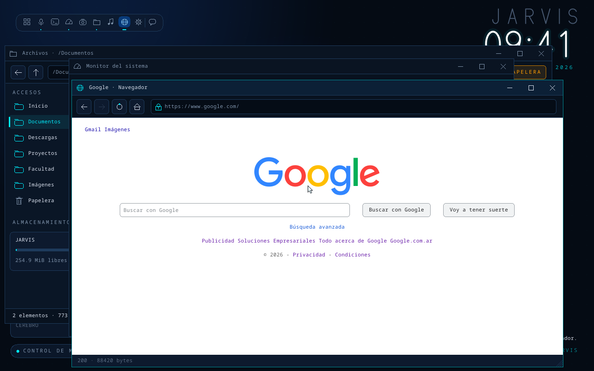
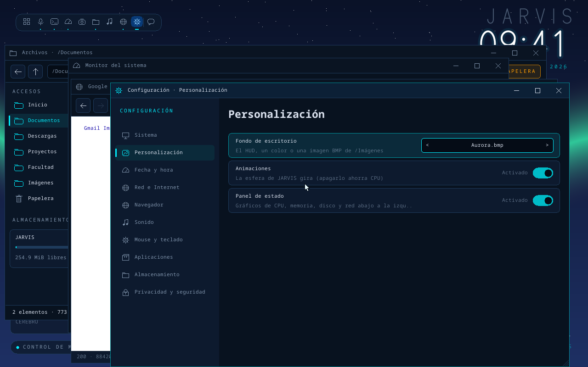
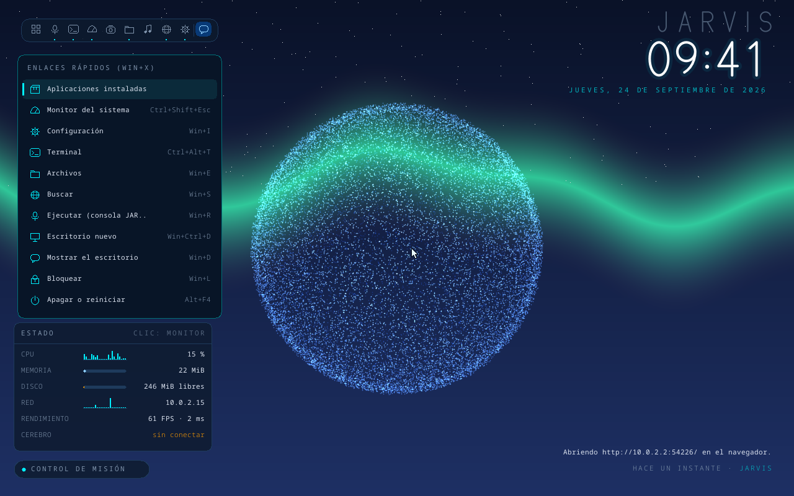
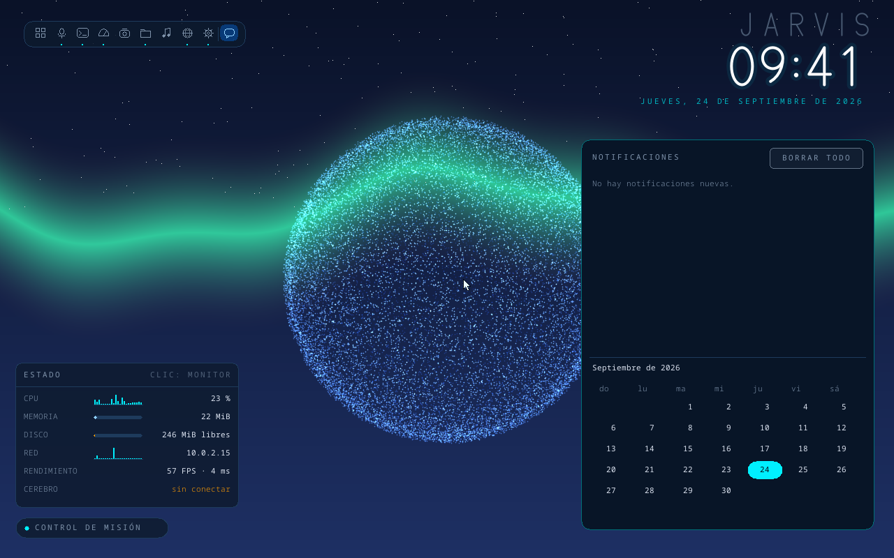

# Kernel de JARVIS-OS

Kernel propio en Rust para x86_64 con arranque UEFI. Decisión y motivos: [ADR 0003](adr/0003-kernel-propio-rust.md).
Red y navegador: [ADR 0004](adr/0004-red-y-navegador-propio.md). Terminal, paquetes y programas de
otros sistemas: [ADR 0005](adr/0005-terminal-paquetes-y-programas.md).

| Escritorio | Terminal y `apt` |
|---|---|
|  |  |
| **Navegador con CSS (Google)** | **Configuración** |
|  |  |
| **Win+X** | **Win+N: notificaciones y calendario** |
|  |  |

- **JARVIS**: la esfera gira en tiempo real y late cuando JARVIS habla. El reloj usa una fuente
  vectorial propia (nítida a cualquier tamaño), en 24 o 12 horas.
- **Ventanas como en Windows**: barra de título con minimizar, maximizar y cerrar; arrastrar para
  mover, esquina para cambiar el tamaño, doble clic para maximizar. Alt+Tab, Win+D, Win+flechas,
  escritorios virtuales, enlaces rápidos (Win+X), configuración rápida (Win+A), notificaciones con
  calendario (Win+N), menú de la ventana (Alt+Espacio) y más: ver la tabla de abajo o F1.
- **Terminal** (Ctrl+Alt+T): shell `jsh` parecida a bash, con tuberías, redirecciones, variables,
  comodines, historial, Tab y colores; ~80 comandos de Linux sobre el FAT32 propio y un `/proc`.
- **`apt`**: instala, actualiza y desinstala programas de JARVIS-OS desde el repositorio del
  proyecto (`kernel/paquetes/`). `neofetch`, `cowsay`, `fortune`, fondos de pantalla…
- **Programas de Windows y Linux**: se descargan (navegador o `wget`) y se inspeccionan (`file`,
  `strings`, `xxd`); todavía no se pueden ejecutar (hace falta espacio de usuario: K9).
- **Configuración** (Win+I): fondo de pantalla, zona horaria, reloj, red, navegador, sonido,
  mouse, teclado, programas, almacenamiento y PIN de bloqueo. Se guarda en `/Sistema/config.ini`.
- **Navegador con CSS**: colores, fondos, tamaños, alineación, `display`, variables, formularios
  (GET) e imágenes (el puente las convierte a BMP). Modo lectura con F9. Descargas a /Descargas.
- **Teclado latinoamericano** (ñ, tildes con tecla muerta, AltGr+Q = @) o de EE. UU.
- **Panel de estado** (abajo a la izquierda) con gráficos en vivo de CPU, memoria, disco y red.
- **Apps**: Archivos, Terminal, Configuración, Monitor, Consola JARVIS, Editor, Música, Visor y
  Navegador.
- **Red propia**: driver virtio-net, TCP/IP (smoltcp), DHCP y DNS. Las páginas `https://` pasan por
  un puente en el anfitrión (el kernel todavía no tiene TLS).

## Cómo correrlo

Requisitos: [rustup](https://rustup.rs) y [QEMU](https://www.qemu.org). En Windows también hace
falta el compilador de C++ de Visual Studio (Build Tools). El toolchain nightly correcto se instala
solo la primera vez, porque está fijado en `kernel/rust-toolchain.toml`.

```bash
cd kernel
cargo xtask run          # QEMU con ventana, disco persistente, red, sonido y el puente
cargo xtask test         # sin ventana, de punta a punta (lo usa la CI)
cargo xtask screenshot   # capturas del escritorio, las apps y los menús (en target/)
cargo xtask disk --reset # vuelve el disco a su contenido inicial (kernel/rootfs/)
cargo xtask vdi          # target/jarvis-os.vdi para bootear en VirtualBox (VM con EFI)
cargo test               # tests en el host: FAT32, red, escritorio, terminal y gráficos
```

- **El disco** es `kernel/target/disco.img` (FAT32, etiqueta `JARVIS`). Se crea la primera vez con
  el contenido de `kernel/rootfs/` y después **no se toca**: lo que hagas queda guardado entre
  reinicios. Los discos nuevos son de 256 MiB (los creados antes de K4, de 64 MiB, siguen
  funcionando; `disk --reset` crea uno nuevo pero **borra** lo que tenía). Se puede abrir desde
  Windows con 7-Zip.
- **Mouse y teclado**: hacé clic en la ventana de QEMU para que los "capture" (Ctrl+Alt+G los
  libera). Mientras están capturados, la tecla Windows y Alt+Tab van a JARVIS-OS y no a Windows.
  Si Windows igual se queda con alguna combinación (Ctrl+Alt+Supr siempre es de Windows), usá el
  ícono de inicio, el menú de inicio o "Control de misión".
- **Teclado**: por defecto, latinoamericano. Si tu teclado es de EE. UU. (o los símbolos no
  coinciden), cambialo en Configuración → Mouse y teclado.
- **Sonido**: el parlante de la PC suena por DirectSound en Windows. En Linux, definí
  `QEMU_AUDIO=pa` (o `alsa`) antes de `cargo xtask run`.
- **Red**: QEMU da una red privada con DHCP (JARVIS-OS queda en 10.0.2.15) y sale a internet por
  la computadora anfitriona. El puente (HTTPS, imágenes y paquetes) escucha solo en
  127.0.0.1:8118 mientras dura `run`: sin `cargo xtask run`, no hay `https://` ni `apt`.
- Los logs del kernel (puerto serie) salen en la terminal donde corriste `cargo xtask run`.
- En Windows, `xtask` usa la aceleración por hardware (WHPX) si está disponible.
- Para compilar mientras tenés QEMU abierto (la imagen queda bloqueada), usá otra carpeta de
  salida: `CARGO_TARGET_DIR=target/otra cargo xtask test`.

### Atajos de teclado (como en Windows)

| Atajo | Qué hace |
|---|---|
| Win (sola) · Win+S · Ctrl+Esc | menú de inicio: escribí para buscar apps o una dirección web |
| Alt+Tab / Alt+Shift+Tab | cambiar de ventana (con Alt apretado se ve el selector) |
| Alt+Esc | pasar a la ventana siguiente, sin selector |
| Win+Tab | vista de tareas ("Control de misión") |
| Win+D · Win+, | mostrar el escritorio (JARVIS); otra vez, volver |
| Win+M · Win+Shift+M | minimizar todo · volver a mostrar lo minimizado |
| Win+Inicio | minimizar todas menos la activa |
| Win+↑ / Win+↓ | maximizar / restaurar o minimizar |
| Win+← / Win+→ · Win+Shift+↑ | acoplar a la mitad izquierda / derecha · estirar a lo alto |
| Win+Ctrl+D · Win+Ctrl+← / → · Win+Ctrl+F4 | escritorio virtual nuevo · cambiar · cerrarlo |
| Alt+Espacio | menú de la ventana (restaurar, minimizar, maximizar, acoplar, cerrar) |
| Alt+F4 · Ctrl+W | cerrar la ventana (Ctrl+W si la app no lo usa); sin ventanas, Alt+F4 ofrece apagar |
| F11 | maximizar la ventana |
| Win+X | enlaces rápidos (apps, monitor, configuración, terminal, apagar…) |
| Win+A | configuración rápida (sonidos, animaciones, páginas claras, reloj…) |
| Win+N · Win+Alt+D | notificaciones y calendario |
| Win+I | Configuración |
| Win+E | Archivos |
| Win+R | Consola de JARVIS ("Ejecutar") |
| Ctrl+Alt+T · Win+Enter | Terminal (como en Ubuntu) |
| Ctrl+Shift+Esc · Ctrl+Alt+Supr | Monitor del sistema |
| Win+1 … Win+9, Win+0 | el ícono número N de la barra |
| Win+L | bloquear (con PIN, si hay uno en la Configuración) |
| Impr Pant · Win+Shift+S | captura de pantalla a /Imágenes (BMP) |
| Alt+Impr Pant | captura solo de la ventana activa |
| Win+Ctrl+Shift+B | redibujar toda la pantalla |
| F1 | ayuda con todos los atajos |

En el escritorio (sin ventana con foco): Espacio o clic en la esfera hace hablar a JARVIS, Tab
abre Archivos.

| Archivos | |
|---|---|
| Enter / doble clic | abrir: carpeta, texto → editor, BMP → visor, HTML → navegador, `.sh` → se ejecuta, `.exe` → la terminal dice qué es |
| Retroceso / Alt+↑ | subir una carpeta · Alt+← atrás |
| F7 o Ctrl+Shift+N / F6 | nueva carpeta / nuevo archivo de texto |
| F2 | renombrar |
| Ctrl+C / Ctrl+X / Ctrl+V | copiar / cortar / pegar (también carpetas enteras) |
| Supr | a la Papelera (adentro de la Papelera: borrar definitivo, con confirmación) |
| RESTAURAR (en la Papelera) | vuelve a la carpeta de donde vino |
| Clic en NOMBRE / TAMAÑO / MODIFICADO | ordenar por esa columna |
| Letras | ir al primer elemento que empieza así |
| F5 | recargar |

| Navegador | |
|---|---|
| Ctrl+L / Alt+D / F6 / clic en la barra | escribir una dirección o una búsqueda; Enter va |
| Tab / Shift+Tab, Enter | recorrer enlaces y campos de formularios; abrir o enviar (o clic) |
| Alt+← / Retroceso · Alt+→ | atrás · adelante |
| F5 / Ctrl+R · Ctrl+H | recargar · inicio |
| F9 | modo lectura (solo el contenido) |
| Flechas, RePág, AvPág, Espacio, rueda | moverse por la página |

| Terminal | |
|---|---|
| Tab | completar comandos y rutas (dos opciones o más: las muestra) |
| ↑ / ↓ | historial |
| Ctrl+C | cancelar la línea o el comando en curso (una descarga, `sleep`) |
| Ctrl+L · Ctrl+A / Ctrl+E · Ctrl+U / Ctrl+K · Ctrl+W | limpiar · inicio / fin · borrar hasta el inicio / el fin · borrar la palabra |
| RePág / AvPág, rueda | moverse por lo que ya salió |
| Ctrl+D (línea vacía), `exit` | cerrar la terminal |

| Editor | Consola JARVIS | Música |
|---|---|---|
| Ctrl+S guarda (si es nuevo, pide la ruta) | `ayuda` lista las órdenes | ↑ ↓ elegir, Enter reproducir |
| Ctrl+Inicio / Ctrl+Fin | `abrir`, `ir`, `buscar`, `ls`, `cat`, `editar` | Esc detener |
| Cerrar con cambios avisa una vez | `hora`, `estado`, `red`, `captura`, `apagar` | |

### La terminal

```
roman@jarvis:~$ ls -l Documentos | grep txt > lista.txt && cat lista.txt
roman@jarvis:~$ cd Proyectos; cp -r ../Documentos respaldo; tree
roman@jarvis:~$ wget https://ejemplo.com/archivo.zip       # descarga a la carpeta actual
roman@jarvis:~$ find / -name "*.bmp" | wc -l
roman@jarvis:~$ apt update && apt install neofetch && neofetch
```

- **Comandos**: `ls cd pwd cat head tail wc grep sed sort uniq cut tr rev tee seq expr echo
  printf find tree du df free stat file xxd strings touch mkdir rmdir rm cp mv ps kill top uname
  whoami hostname id date cal uptime ip ping curl wget apt dpkg history alias export env which
  test sleep sh open nano jarvis screenshot reboot shutdown exit` y más (`help`, `man <comando>`).
- **Shell**: `|`, `>`, `>>`, `<`, `2>`, `2>&1`, `&&`, `||`, `;`, `'…'`, `"…$VAR…"`, `$(…)`, `$?`,
  `*.txt`, `~`, alias (`ll`, `la`, `dir`, `cls`, `ipconfig`…), `VAR=valor`.
- **`/proc`**: `cpuinfo`, `meminfo`, `uptime`, `version`, `loadavg`.
- **`rm` no borra para siempre**: manda a la Papelera, como la app Archivos.
- **Programas propios**: un archivo en `/Programas/bin` con comandos (uno por línea) es un
  programa: `nano /Programas/bin/saludo`, escribí `echo Hola, $1` y después `saludo Roman`.

### Paquetes: `apt`

| Orden | Qué hace |
|---|---|
| `apt update` | baja la lista de paquetes del repositorio |
| `apt list` (`--installed`, `--upgradable`) · `apt search x` · `apt show x` | ver qué hay |
| `apt install x y` | instala (con dependencias) |
| `apt remove x` | desinstala: los archivos van a la Papelera |
| `apt upgrade` | actualiza lo instalado |

El repositorio es la carpeta `kernel/paquetes/` (lo sirve el puente en `http://paquetes.jarvis/`):
`indice.txt` y un `manifiesto.txt` por paquete. Para agregar un paquete: una carpeta con sus
archivos y su manifiesto (`origen -> /destino`, `[bmp]` si es una imagen a convertir), y un
renglón en el índice. Paquetes de ejemplo: `neofetch`, `cowsay`, `fortune`, `sl`, `calc`, `hola`,
`fondos`, `manual` y `esenciales` (instala varios de una vez).

## Arquitectura

```
firmware UEFI (OVMF en QEMU)
  └─ bootloader (crate bootloader 0.11): modo 64 bits, tablas de páginas, framebuffer,
     mapeo de toda la memoria física
       └─ kernel_main (kernel/kernel/src/main.rs) — solo hardware
            ├─ serial.rs      COM1: logs al host
            ├─ gdt.rs         GDT + TSS (stack de emergencia para el doble fallo)
            ├─ interrupts.rs  IDT: excepciones, timer (IRQ0), teclado (IRQ1), mouse (IRQ12)
            ├─ pit.rs         PIT: despierta al bucle (250 Hz) y calibra el TSC
            ├─ time.rs        reloj en ms con el TSC
            ├─ queue.rs       cola de bytes sin locks (interrupción → bucle)
            ├─ keyboard.rs    teclado PS/2 → teclas y modificadores (Alt, Ctrl, Win, AltGr),
            │                 distribución EE. UU. o latinoamericana (desktop/keymap.rs)
            ├─ mouse.rs       mouse PS/2 con rueda (puerto auxiliar del 8042)
            ├─ allocator.rs   heap de 256 MiB (alloc: Vec, String)
            ├─ pci.rs         enumeración del bus PCI
            ├─ virtio_blk.rs  driver de disco virtio-blk (DMA, virtqueue, polling)
            ├─ virtio_net.rs  driver de placa de red virtio-net (dos virtqueues, polling)
            ├─ speaker.rs     parlante de la PC (canal 2 del PIT)
            ├─ power.rs       apagar (ACPI de QEMU) y reiniciar (8042)
            ├─ cpu.rs         nombre de la CPU (cpuid)
            ├─ rtc.rs         reloj CMOS → fecha y hora
            └─ bucle          hlt → red → eventos → render → present → pedidos → estadísticas
                 ├─ jarvis-net      TCP/IP (smoltcp), DHCP, DNS, descargas HTTP
                 └─ jarvis-desktop  ventanas, atajos, apps, barra, panel, menús, configuración,
                    │               terminal (jsh + apt), web (DOM, CSS, HTML, HTTP)
                      ├─ jarvis-fs   FAT32 sobre el disco (con caché de sectores)
                      └─ jarvis-gfx  dibujo: HUD, esfera, texto, fuente vectorial, figuras
```

| Crate | Qué es | Cómo se prueba |
|---|---|---|
| `gfx` (`jarvis-gfx`) | Dibujo: canvas con recorte y `blit`, paleta, texto, **fuente vectorial**, figuras, íconos, trigonometría en punto fijo, esfera, asistente, HUD. | `cargo test`: 37 tests |
| `fs` (`jarvis-fs`) | FAT32 propio: montaje, FAT (dos copias), nombres largos, lectura, escritura, carpetas, renombrar, mover, **copiar**, borrar, **caché de sectores**. Sobre un trait `BlockDevice`. | 22 tests, 14 de ellos **cruzados contra `fatfs`**: cada uno lee lo que escribe el otro, y el espacio libre se cuenta sobre la FAT cruda |
| `desktop` (`jarvis-desktop`) | Escritorio: gestor de ventanas (con escritorios virtuales), atajos, barra, panel de estado, menús y paneles, configuración, composición; apps (Archivos, Terminal, Configuración, Monitor, Consola, Editor, Música, Visor, Navegador); shell `jsh`, `apt`, formatos PE/ELF; web: URL, HTTP, DOM, CSS y HTML; teclado latinoamericano. | 98 tests: el escritorio manejado con teclas y clics sobre un disco en memoria, verificado con `fatfs`; la terminal y `apt` contra el repositorio real; incluye "render incremental == redibujar todo". Más `vista_previa` (a mano): arma una página real y la guarda en BMP |
| `net` (`jarvis-net`) | Red: smoltcp, DHCP, DNS (con respaldo), descargas HTTP con redirecciones, HTTPS por el puente. | 3 tests de punta a punta en memoria (placa "loopback" + servidor HTTP de juguete) |
| `kernel` (`jarvis-kernel`) | El binario sin sistema operativo debajo. Solo hardware → eventos, bloques y píxeles. | `cargo xtask test` en QEMU |
| `xtask` | Imagen booteable, disco FAT32, QEMU (serie + monitor + red + audio), puente (HTTPS, repositorio de paquetes, conversión de imágenes), test de punta a punta, capturas. | 2 tests (el puente no sale de su carpeta; PNG → BMP) y `cargo xtask test` |

## Lo que se aprendió (y por qué el código es así)

### K4: terminal, paquetes, configuración y CSS
- **Una shell sin procesos**: `jsh` es una biblioteca del escritorio, no un programa. Cada comando
  recibe sus argumentos y la entrada estándar y devuelve texto: una tubería es pasar el texto de
  uno al siguiente. Lo que tiene que esperar a la red no puede bloquear (hay un solo hilo): el
  comando devuelve un "trabajo pendiente", la shell guarda en qué parte de la línea quedó y sigue
  cuando llega la respuesta. Es un planificador cooperativo en miniatura (K7 lo hace de verdad).
- **Las palabras se expanden al ejecutar**, no al leer: por eso `false || echo $?` dice 1. Y las
  asignaciones (`N=$(wc -l < x)`) no se parten en palabras, como en bash.
- **Programas = scripts**: sin espacio de usuario no hay dónde cargar un ELF o un `.exe`. Los
  scripts de `jsh` alcanzan para `neofetch` o `cowsay` y sirven de ejemplo de cómo se distribuyen
  programas con dependencias y versiones.
- **La ventana TCP depende del driver**: el driver decía `max_burst_size = 1` y smoltcp limitaba la
  ventana de recepción a un paquete por ida y vuelta: ~90 KB/s. Sin ese tope (la cola de
  recepción tiene 256 buffers) y con 512 KiB de buffer TCP, 3 MB bajan en un segundo.
- **CSS con índices**: una página grande tiene miles de reglas. Como en los navegadores, cada regla
  se indexa por lo que exige su último selector (id, clase o etiqueta) y cada elemento solo
  prueba las que le pueden tocar.
- **Flex sin cajas**: sin maquetación de cajas, lo que más se acerca es poner en fila solo a los
  hijos directos de un `display: flex` (los menús). Hacerlo con todos los descendientes juntaba
  páginas enteras en un párrafo.
- **Teclado por posición**: QEMU manda la tecla física (scancode). La distribución es una tabla
  "tecla física → carácter" y los acentos son teclas muertas que esperan la siguiente.

### K3: ventanas, red y navegador
- **Composición por ventana**: cada ventana tiene su propio buffer y solo se redibuja cuando su
  app cambia. En cada frame se juntan las zonas que cambiaron (la esfera siempre, el reloj una vez
  por minuto, una ventana que se movió…), se restauran desde el fondo y se pintan las capas de
  atrás hacia adelante con **recorte**. Mover una ventana cuesta copiar dos rectángulos, no
  redibujar su contenido. Si una ventana maximizada tapa la esfera, la esfera ni se anima.
- **Qué cambió = comparar antes y después**: en vez de que cada acción avise qué redibujar, el
  escritorio saca una foto de la geometría de las ventanas antes de cada evento y la compara con
  la de después. Así no se puede olvidar un caso (y el test de render incremental lo verifica).
- **Modificadores como eventos**: Alt+Tab necesita saber cuándo se *suelta* Alt, y la tecla
  Windows sola abre el menú solo si no se usó en un atajo. Por eso el teclado manda un evento
  cada vez que cambian Shift, Ctrl, Alt o Win, y el escritorio lleva la cuenta.
- **Red por capas**: el driver (virtio-net) solo mueve tramas Ethernet; smoltcp arma IP, TCP,
  DHCP y DNS; `jarvis-net` hace las descargas; el navegador solo ve "pedí esta URL" y "llegó
  esta respuesta" (por el `Outbox`). Cada capa se prueba sola: la red, con una placa "loopback".
- **DNS con respaldo**: en la máquina donde se desarrolló, el DNS no resolvía algunos nombres
  (tampoco desde Windows: el problema era de esa red). Por eso hay DNS públicos de respaldo y,
  si igual falla, la página se pide por el puente.
- **Fuente vectorial**: la hora era la fuente bitmap agrandada ×2 (bordes borrosos). Ahora cada
  dígito son trazos que se rasterizan al tamaño exacto, midiendo la distancia de cada píxel al
  trazo, con 1 px de suavizado. Se rasteriza una vez y queda en caché.
- **Uso de CPU**: es el tiempo que el bucle **no** pasó dormido en `hlt`, medido con el TSC.

### K2: disco, FAT32 y Archivos
- **DMA y direcciones físicas**: el disco virtio lee y escribe la memoria por su cuenta, con
  direcciones **físicas**. El heap está en una región física contigua mapeada linealmente, así que
  ahí física = virtual − offset. El stack no cumple eso, por eso el driver copia a un **buffer
  intermedio** propio antes de cada pedido.
- **Virtqueues**: en vez de imitar registros de un disco real, kernel y dispositivo comparten
  anillos en memoria. Un pedido son 3 descriptores (cabecera, datos, estado); el kernel lo publica,
  "toca el timbre" y espera (por *polling*) a que aparezca en el anillo de usados. Hay `fence`
  entre escribir el anillo y su índice: sin eso, el dispositivo podría ver el índice antes que el dato.
- **FAT32 es una lista enlazada en disco**, y cada error ahí corrompe el disco. Por eso hay una
  implementación de referencia en los tests (`fatfs`) y un contador independiente de clusters
  libres. Las operaciones que pueden fallar a la mitad se ordenan para no perder datos: al mover,
  primero se crea en el destino y después se borra del origen; si un renombrado no entra, se
  restaura el nombre viejo.
- **Nombres largos (LFN)**: se guardan en entradas extra de 13 caracteres UTF-16, en orden inverso
  y con un checksum del nombre corto. Cada archivo con nombre largo necesita además un alias 8.3
  único (`NOTASD~1.TXT`), que se ve en el inspector.
- **Borrar = mover a la Papelera**, la misma regla de seguridad que el cerebro de JARVIS. El borrado
  definitivo existe solo adentro de la Papelera y siempre pide confirmación.
- **Cursor por software**: se dibuja sobre la pantalla después de copiar el frame, restaurando
  antes lo que tapaba. Así nunca queda en el buffer donde se compone la imagen.
- **Mouse PS/2**: paquetes de 3 bytes; si se pierde uno, todo queda corrido. Por eso el
  decodificador se resincroniza con el bit 3, que siempre está en el primer byte.
- **El kernel como capa fina**: toda la interfaz vive en `jarvis-desktop` y se prueba sin QEMU. El
  test de "render incremental == redibujar todo" cubre también la ventana de Archivos.

### K0–K1: arranque, tiempo y gráficos
- **Sin `std`**: no hay sistema operativo que provea archivos, hilos ni memoria. El heap lo arma el
  propio kernel sobre la RAM libre que informa el bootloader.
- **Punto flotante por software** (target `x86_64-unknown-none`): por frame, todo es **punto fijo
  Q14** con una **tabla de senos** calculada al compilar. Los `f32` solo se usan al inicializar.
- **No medir el tiempo contando interrupciones**: en QEMU emulado se perdía un tercio y el reloj
  del kernel iba al 68 %. El tiempo sale del **TSC** calibrado contra el PIT, como en Linux.
- **Manejadores de interrupción mínimos** y colas **sin locks**: un manejador que espera un lock
  tomado por el bucle principal traba el kernel para siempre.
- **Doble buffer + rectángulos sucios + recorte**, con un test que exige que el render incremental
  sea idéntico, byte a byte, a dibujar todo de cero.

## Roadmap

El orden cambió varias veces a pedido: el gestor de archivos (K2), el escritorio con red (K3) y la
terminal con paquetes (K4) se adelantaron.

| Hito | Qué se logra | Qué se aprende |
|---|---|---|
| **K0** ✅ | Arranca en QEMU y dibuja el HUD | Arranque UEFI, framebuffer, E/S por puertos, `no_std` |
| **K1** ✅ | Interrupciones, timer + TSC, teclado, heap. Esfera animada y pulsaciones al hablar | Interrupciones, PIC, calibración de tiempo, concurrencia sin locks |
| **K2** ✅ | **Archivos**: PCI, virtio-blk, FAT32 propio, mouse PS/2 | Drivers con DMA, sistemas de archivos, UI dirigida por eventos |
| **K3** ✅ | **Escritorio y red**: ventanas y atajos como Windows, monitor, apps, virtio-net + TCP/IP, navegador | Composición, gestores de ventanas, redes, HTTP/HTML |
| **K4** ✅ | **Terminal y sistema**: shell `jsh`, `apt`, Configuración, más atajos, escritorios virtuales, navegador con CSS e imágenes, teclado latinoamericano | Intérpretes, gestión de paquetes, CSS y la cascada |
| K5 | **Puente con el cerebro**: la consola de JARVIS le habla a Claude (por la red, al `jarvis` del anfitrión) y la esfera pulsa con la respuesta | Protocolos, el sistema "piensa" |
| K6 | Paginación propia (tablas de páginas del kernel, no las del bootloader) | Memoria virtual, allocators de frames |
| K7 | Multitarea: scheduler y tareas del kernel. Disco y red por interrupciones | Cambio de contexto, sincronización |
| K8 | **TLS en el kernel** (sin puente) y decodificadores PNG/JPEG | Criptografía, certificados, compresión |
| K9 | Espacio de usuario: ring 3, syscalls, cargador ELF. Los primeros programas de Linux estáticos; después, un navegador más completo | Aislamiento, ABI |
| K10 | Audio (virtio-sound/HDA) → voz real; la envolvente de la esfera sale del audio | Drivers de audio |
| K11 | Hardware real: placas de red Intel/Realtek, AHCI/NVMe, USB, ACPI, arranque en la PC | Drivers reales |

Recursos: [Writing an OS in Rust](https://os.phil-opp.com), la [wiki de OSDev](https://wiki.osdev.org),
la especificación de virtio y la especificación "Microsoft FAT32 File System".
