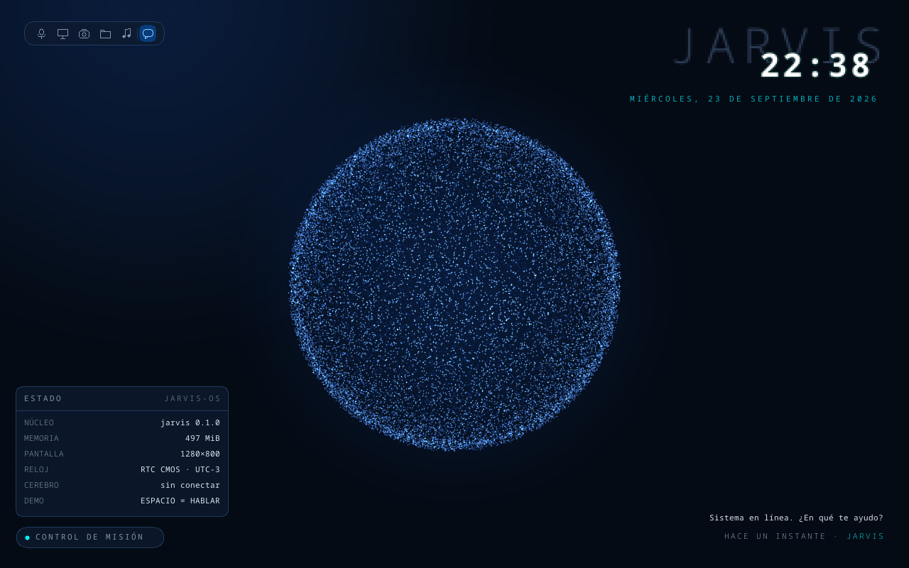
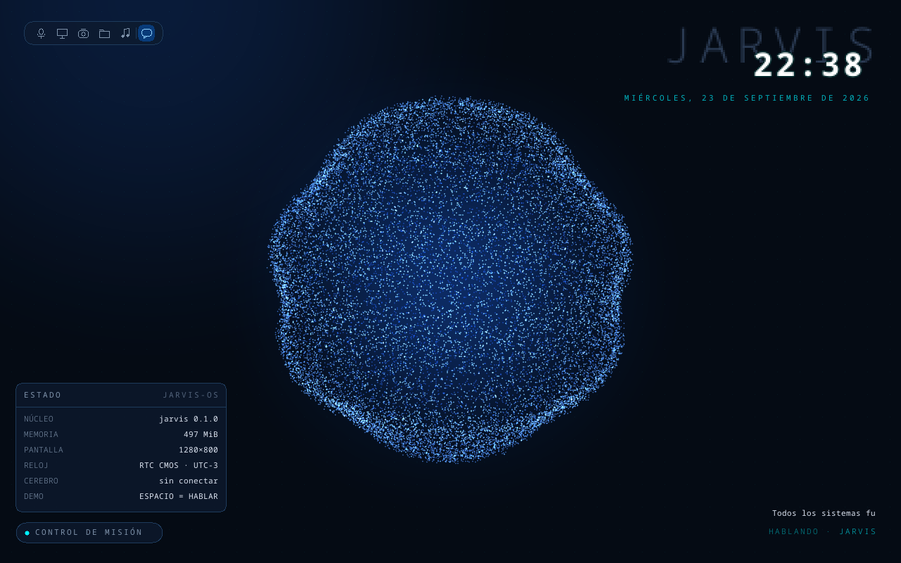

# Kernel de JARVIS-OS

Kernel propio en Rust para x86_64 con arranque UEFI. Decisión y motivos: [ADR 0003](adr/0003-kernel-propio-rust.md).

| En reposo | Hablando |
|---|---|
|  |  |

La esfera gira en tiempo real (una vuelta cada 25 s) y respira. Cuando JARVIS habla, late al ritmo
de las sílabas, le corren ondas por la superficie y brilla más, mientras el mensaje se escribe letra
por letra. Por ahora JARVIS "habla" al arrancar y con **Espacio** o **Enter** (frases de demo):
todavía no hay audio (K9) ni conexión con Claude (K4).

## Cómo correrlo

Requisitos: [rustup](https://rustup.rs) y [QEMU](https://www.qemu.org). En Windows también hace
falta el compilador de C++ de Visual Studio (Build Tools). El toolchain nightly correcto se instala
solo la primera vez, porque está fijado en `kernel/rust-toolchain.toml`.

```bash
cd kernel
cargo xtask run          # compila, arma la imagen UEFI y abre QEMU (Espacio = JARVIS habla)
cargo xtask test         # sin ventana: arranque + Espacio → JARVIS_HABLA (lo usa la CI)
cargo xtask screenshot   # capturas en reposo y hablando en target/
cargo xtask vdi          # target/jarvis-os.vdi para bootear en VirtualBox (VM con EFI)
cargo test -p jarvis-gfx # tests de la lógica (dibujo, asistente, doble buffer), en el host
```

- Los logs del kernel (puerto serie) salen en la terminal donde corriste `cargo xtask run`,
  incluido el rendimiento cada 5 s.
- En Windows, `xtask` usa la aceleración por hardware (WHPX) si está disponible: ~2 ms por frame
  contra ~18 ms emulando por software.
- Para compilar mientras tenés QEMU abierto (la imagen queda bloqueada), usá otra carpeta de
  salida: `CARGO_TARGET_DIR=target/otra cargo xtask test`.

## Arquitectura

```
firmware UEFI (OVMF en QEMU)
  └─ bootloader (crate bootloader 0.11): modo 64 bits, tablas de páginas, framebuffer,
     mapeo de toda la memoria física
       └─ kernel_main (kernel/kernel/src/main.rs)
            ├─ serial.rs      COM1: logs al host
            ├─ gdt.rs         GDT + TSS (stack de emergencia para el doble fallo)
            ├─ interrupts.rs  IDT: excepciones, timer (IRQ0), teclado (IRQ1); PIC 8259
            ├─ pit.rs         PIT: canal 0 despierta al bucle (250 Hz), canal 2 calibra el TSC
            ├─ time.rs        reloj en ms con el TSC
            ├─ keyboard.rs    cola sin locks IRQ → bucle, decodificación PS/2
            ├─ allocator.rs   heap de 64 MiB (alloc: Vec, String)
            ├─ rtc.rs         reloj CMOS → fecha y hora (UTC → hora de Argentina)
            └─ bucle          hlt → teclado → asistente → Scene::render → copia a pantalla
                 └─ jarvis-gfx  escena: capa estática, esfera, reloj, mensaje, asistente
```

| Crate | Qué es | Cómo se prueba |
|---|---|---|
| `gfx` (`jarvis-gfx`) | Todo lo que no toca hardware: canvas y recorte, paleta, texto, figuras, trigonometría en punto fijo, esfera animada, asistente (envolvente de voz), escena con doble buffer. `no_std` + `alloc`. | `cargo test -p jarvis-gfx` en el host (34 tests) |
| `kernel` (`jarvis-kernel`) | El binario que corre sin sistema operativo debajo. Conecta hardware con la lógica. | Arrancándolo en QEMU (`cargo xtask test`) |
| `xtask` | Herramienta del host: imagen, QEMU (serie + monitor), test de teclado, capturas, VirtualBox. | Se usa en cada `cargo xtask` |

## Lo que se aprendió (y por qué el código es así)

- **Sin `std`**: no hay sistema operativo que provea archivos, hilos ni memoria. El heap lo arma el
  propio kernel (`allocator.rs`) sobre la RAM libre que informa el bootloader.
- **Punto flotante por software**: el target `x86_64-unknown-none` compila los `f32` como llamadas a
  rutinas de software (activar SSE requeriría un target propio). Por eso la animación usa **punto
  fijo Q14** (`ONE = 16384` representa 1,0) y una **tabla de senos** de 1024 valores calculada en
  tiempo de compilación. Los `f32` solo se usan una vez, al generar las partículas.
- **No medir el tiempo contando interrupciones**: la primera versión contaba 1000 IRQ del timer
  por segundo. En QEMU emulado se perdía un tercio y el reloj del kernel iba al **68 %** (el texto
  se escribía lento). Ahora el tiempo sale del **TSC** (contador de ciclos de la CPU), calibrado al
  arrancar contra el canal 2 del PIT por *polling*, como hace Linux. Medido: 100 %.
- **Manejadores de interrupción mínimos**: el timer solo despierta a la CPU y el teclado solo guarda
  el byte en una cola **sin locks** (un productor, un consumidor). Si un manejador tomara un lock que
  el bucle principal tiene tomado, el kernel se trabaría para siempre.
- **Doble buffer + rectángulos sucios + recorte**: cada frame restaura desde la capa estática solo
  lo que cambia (esfera, reloj, mensaje), dibuja con recorte a esas zonas y copia solo eso a la
  pantalla. Un test compara el render incremental contra dibujar todo de cero y exige que sean
  idénticos byte a byte. Ese test encontró un error real: el reloj se redibujaba sobre sí mismo
  donde tocaba la zona de la esfera.
- **Resolución**: el kernel no pide un tamaño. El bootloader deja el modo del firmware (1280×800 en
  QEMU, la nativa del monitor en una PC real). Si se pide un mínimo, salta al modo *más grande*.

## Roadmap

| Hito | Qué se logra | Qué se aprende |
|---|---|---|
| **K0** ✅ | Arranca en QEMU y dibuja el HUD: esfera, reloj real, paneles, mensaje | Arranque UEFI, framebuffer, E/S por puertos, `no_std` |
| **K1** ✅ | GDT, IDT y excepciones; timer y TSC; teclado PS/2; heap. Esfera animada, pulsaciones al hablar, reloj en vivo | Interrupciones, PIC, calibración de tiempo, concurrencia sin locks |
| K2 | Paginación propia (tablas de páginas del kernel, no las del bootloader) | Memoria virtual, allocators de frames |
| K3 | Mouse, compositor y widgets (ventanas del HUD); layout de teclado latinoamericano | Eventos, dibujo incremental |
| K4 | **Puente con el cerebro**: escribís en el HUD → puerto serie → `jarvis` en el host → Claude → respuesta en pantalla (y la esfera pulsa con la respuesta) | Protocolos, el sistema "piensa" |
| K5 | Multitarea: scheduler y tareas del kernel | Cambio de contexto, sincronización |
| K6 | Disco (virtio-blk/AHCI) y sistema de archivos | Drivers de bloque, FAT/propio |
| K7 | Red: virtio-net + TCP/IP (smoltcp). El puente pasa a red | Drivers de red, pila TCP/IP |
| K8 | Espacio de usuario: ring 3, syscalls, cargador ELF | Aislamiento, ABI |
| K9 | Audio (virtio-sound/HDA) → voz real; la envolvente de la esfera sale del audio | Drivers de audio, DMA |
| K10 | Hardware real: USB, GPU básica, arranque en la PC | Drivers reales |

Recursos: [Writing an OS in Rust](https://os.phil-opp.com) (sigue un camino muy parecido a K0–K5)
y la [wiki de OSDev](https://wiki.osdev.org).
